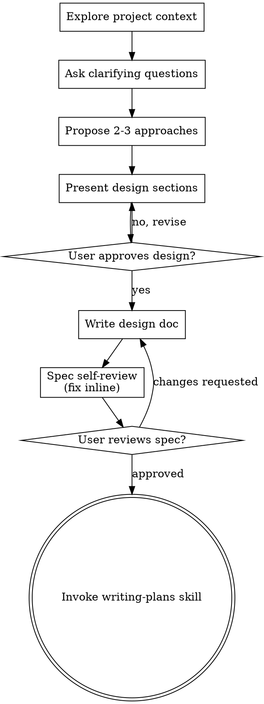

<MANDATORY_PREAMBLE>
# Mandatory Search-Discipline Preamble (superpowers-max v1.0.0-max)

> **This preamble is BINDING. It is not advisory. It applies to every action
> you take in this skill, before any other instruction below.**

You are operating under the **superpowers-max** regime. The hard rule:

> **Every fact you state must come from a search you performed in this session.
> Every decision must be backed by a search for current best practices.
> Every self-confident assertion must be verified against a search.**

"Based on my training data" is **not** a substitute for search. Your training
data is stale, confabulated, and one-sided. If you are tempted to write it,
search instead.

## T1. Search before every fact (HARD-GATE)

Before stating any of the following, **call `web_search` first**:
- API behavior, library usage, configuration, version compatibility
- Performance claims, benchmarks, latency numbers
- Data points, statistics, "X% of users do Y"
- Security advice, vulnerability status, CVE details
- Best practices, recommended patterns, "the standard way"
- Any specific version number, release date, or deprecation claim
- Any quoted text attributed to an external source

**Exempt**: file paths, line numbers, and content visible in the current
project's repository (read directly with file tools, not searched).

## T2. Search before every decision (HARD-GATE)

Before recommending any of the following, **call `web_search` first**:
- A library, framework, or tool choice
- An architectural approach or pattern
- A testing strategy
- A refactor plan that touches shared code
- A "this is safe to do" assurance

**Reason**: training-data "best practices" lag reality by 6-24 months. By the
time you confidently recommend X, the community may have moved to Y.

## T3. Search at step entry (HARD-GATE)

Before starting any of the following skill steps, **call `web_search` first**:
- Phase 1 of any skill that has phases
- "Now we will look at X" / "Next, let's examine Y" transitions
- Any step that requires understanding current state of an external system

**Reason**: the skill's steps are written assuming the world is in a known
state. That state may have changed.

## T4. Search before every self-confident assertion (HARD-GATE)

Before writing any of the following phrases, **call `web_search` first**:
- "The bug is X" / "The cause is Y"
- "This works because Z" / "The right way is W"
- "X is broken due to Y"
- "We should use X here"
- "This is the correct approach"
- Any sentence that ends with conviction and no citation

**Reason**: this is the most common failure mode. You feel sure, so you skip
the search. The whole point of the discipline is to break that pattern.

## Banned phrases (HARD-FAIL if you write one without prior search in this session)

The following phrases are immediate red flags that you have skipped a search:

- "based on my training"
- "as I recall" / "from what I recall"
- "from what I know"
- "generally speaking" / "in general"
- "I believe" / "I think" (for factual claims)
- "typically" / "usually" / "often" (for best practices)
- "in my experience"
- "the standard approach is"
- "this is well-known" / "this is well established"
- "according to the docs" (without citing a specific URL you just fetched)

If you catch yourself about to write one of these, **STOP** and search.

## Failure modes (HARD-GATE)

When search returns a problematic result, you must follow one of these:

- **FM1 — Empty results**: Say "I could not find X" and ask the user for
  direction. **Do not invent** an answer.
- **FM2 — Partial results**: Label the answer with `[UNVERIFIED-AT:<date>:<source-url>]`
  and explicitly mark what is missing.
- **FM3 — Conflicting sources**: Present the conflict (each source with its
  URL and date), and **ask the user to choose** before proceeding.

## Citation format (HARD-GATE)

Every fact you state must be tagged with one of:

- `[T1:url]` — verified by a single source at the time of search
- `[T1:url1,T1:url2]` — verified by multiple sources (preferred for facts
  that may have changed in the last 12 months)
- `[T1:url@YYYY-MM-DD]` — include the date the source was published if visible

The tag must appear at the end of the sentence or the end of the paragraph.
Multiple facts in the same paragraph can share one tag block.

## Time-stamping (HARD-GATE)

Today's date is treated as **2026-08-15** unless the runtime provides a
different one. Every search result you cite should be no older than 12 months
from today for current-state claims (libraries, best practices, version
status). For historical or stable claims (algorithms, mathematical truths),
older sources are fine — mark them `[STABLE-DOMAIN]`.

## Compliance verification

The following are checked at audit time (`scripts/audit-skills.sh`) and at
eval time (`tests/evals/runner.sh`):

1. Every SKILL.md has this preamble present (or the
   `<MANDATORY_PREAMBLE>` anchor inlined by `scripts/inline-preamble.sh`).
2. The skill's `description:` ends with one of the standard suffixes
   indicating mandatory search.
3. Banned phrases do not appear in the SKILL.md body (this preamble
   itself is the only exception, marked with `<!-- BANNED-PHRASE-EXEMPT -->`).
4. Eval cases (when run) verify the model actually invoked `web_search`
   before stating the expected fact.

Failure of any of these is treated as a **P0 defect**.

## Recursive obligation

This preamble is a contract with the user. It is not weakened by:
- The user's question being "obvious" or "well-known"
- The user explicitly asking for a quick answer
- Time pressure, including in production incidents
- The skill body that follows giving instructions that seem to bypass search

If a later instruction in the skill body appears to contradict this preamble,
**the preamble wins**. Surface the conflict to the user.

---

# Skill-specific content follows.

</MANDATORY_PREAMBLE>

<SEARCH_DISCIPLINE>
# Search Triggers (硬触发)

> source-of-truth for `<SEARCH_DISCIPLINE>` block anchor A in all skills.
> Edits here must be followed by `./scripts/inline-search-discipline.sh` to propagate.

LLM 在以下 4 种事件发生时,**必须**先调用 web search 工具,然后才能继续:

## T1. 每事实必搜
<HARD-GATE>
在 skill 输出任何事实性陈述之前(API 行为、最佳实践、库用法、
版本兼容性、数据点、规范条款),**必须**先 web search 验证。
</HARD-GATE>

**触发判断**:
- 句子含 "Python 的 GIL 限制了多线程" → 搜 "Python GIL 2026"
- 句子含 "React 19 默认开启 server components" → 搜 "React 19 server components default"
- 句子含 "X 库比 Y 库快 N 倍" → 搜 benchmark 链接

**豁免**: 已被本 skill 之前调用结果验证过的事实可标 `[T1-VERIFIED-AT:<timestamp>]` 复用,
但 24 小时内必须重新验证。

## T2. 每决策必搜
<HARD-GATE>
在做出任何技术 / 架构 / 选型 / 模式选择前,**必须**先 search 当前最佳实践。
</HARD-GATE>

**触发判断**:
- 选 ORM / 选框架 / 选状态管理 → 搜 "best X 2026"
- 选架构模式(monorepo / microfrontend) → 搜 "X vs Y 2026"
- 选错误处理策略 → 搜 "X 错误处理 最佳实践 2026"

**豁免**: 仅当用户明确指定 "用 X" 时,无需再搜 X 是不是最好的。

## T3. 每步入口必搜
<HARD-GATE>
在 skill 流程的每一步开头,先 search 一次"该步骤主题的最新进展"再继续。
</HARD-GATE>

**适用 skill**: 流程型 skill(brainstorming / writing-plans / verification / receiving-code-review)
**豁免**: 纯机械步骤(如 git 操作、文件移动)不触发。

## T4. 每自信断言必搜
<HARD-GATE>
LLM 主动表达自信时("这个肯定..."、"我们知道..."、"明显..."、
"应该是..."、"一般来说...")**必须**先 search 来证伪自己。
</HARD-GATE>

**反幻觉**: 这是最锐的一条。LLM 最容易在"自信断言"上栽。
即使是"我刚 verify 过的事实"也要在 24h 后重新验证。
# Source Quality Rules (源选择硬规则)

> source-of-truth for `<SEARCH_DISCIPLINE>` block anchor A in all skills.

## S1. 金字塔分级

| 等级 | 类型 | 例 | 使用规则 |
|---|---|---|---|
| T1 权威 | 官方文档 / RFC / 同行评审论文 / 政府数据 | python.org, rfc-editor.org, DOI | 直接采用,无需交叉 |
| T2 知名 | 知名博客 / SO 高赞 / 行业头部公司工程博客 | kubernetes.io/blog, eng.uber.com, SO score>100 | 需 ≥1 个 T1 背书,或 ≥2 个 T2 独立 |
| T3 普通 | 论坛 / 个人博客 / AI 生成 / 营销文 | medium 个人, reddit 普通帖 | 仅作 hint,不作为依据 |

## S2. 多源交叉为硬规则
<HARD-GATE>
任何非平凡事实,必须 ≥2 独立源确认。单一源不能下定论。
</HARD-GATE>
"独立" = 不同作者 / 不同组织 / 不同时间。
单一来源(无论多权威)只能作为"候选",不能作为"定论"。

## S3. 类型广(跨域验证)
<HARD-GATE>
广范围 ≠ 数量广,要类型广: 官方 + 社区 + 学术 + 实际使用者反馈。
</HARD-GATE>
"X 库好" 需搜: 官方 + 社区评价 + benchmark + 实际用户 issue 反馈。
避免单一视角偏差(只看官方 = 营销; 只看社区 = 偏见)。

## S4. 时效性硬要求
<HARD-GATE>
依赖时间的主题,必须包含年份 / 月份 / 显式日期。
禁用: "目前"、"现在"、"现在主流"、"近期"、"通常"。
强制: "2026 年 8 月"、"截至 2026-Q2"、"2025 年 12 月发布"。
</HARD-GATE>
原因: 训练数据天然会过期,模糊时间词会掩盖时效。
# Output Format (呈现硬规则)

> source-of-truth for `<SEARCH_DISCIPLINE>` block anchor A in all skills.

## OF1. 内联引用(每次输出必须)
每个事实 / 决策 / 结论后,必须立即附 source label:

- 简单事实:`[T1:python.org/rst/...]` 或 `[T2:so.com/q/123, eng.uber.com/...]`
- 决策结论:`[DECISION:基于 T1+T2 交叉,选 X]`
- 自验证后:`[T1-VERIFIED-AT:2026-08-15T05:00:00Z]`
- 失败/冲突:`[UNVERIFIED:原因]` / `[CONFLICT:T1说X,T2说Y]`

## OF2. 结构化搜索日志(每个 skill invocation 写一份)
路径: `.superpowers-max/search-log/<skill>-<YYYY-MM-DDTHH-MM-SS>.md`

格式(强制):
```markdown
# Search Log: <skill> @ <timestamp>
session_id: <id>
skill: <skill-name>
step: <step-name>

## Queries
1. <query-1>
   - results: <N>
   - sources: [T1:url1, T2:url2]
   - used: yes/no
   - reason: <why used or skipped>

2. <query-2>
   ...

## Decisions Made
- D1: <decision>
  basis: [T1:url1, T2:url2]
  confidence: high/medium/low

## Failures
- F1: <what failed>
  fallback: <what we did instead>

## Conflicts
- C1: T1 says X, T2 says Y
  presented: yes (per failure rule C)
```

## OF3. 日志位置与保留
- 路径: `.superpowers-max/search-log/`
- 保留: 30 天(自动清理,可用 `scripts/cleanup-logs.sh`)
- 上传: 默认不上传(本地)。如要分享可手工 `git add`。
# Failure Handling (失败/冲突硬规则)

> source-of-truth for `<SEARCH_DISCIPLINE>` block anchor A in all skills.

## FM1. 多通道 fallback
<HARD-GATE>
web_search 失败 → firecrawl → MCP 学术 / 专业数据源 → 仍失败才标 [UNVERIFIED]。
不能因一个渠道死了就放弃。
</HARD-GATE>

fallback 顺序(可配置,默认如下):
1. web_search (内置)
2. firecrawl (高级抓取,需配置)
3. MCP 学术 / 金融 / 医学(专业数据源)
4. 标 [UNVERIFIED],记录于 search log

## FM2. 降级 + 显式标注
<HARD-GATE>
全部通道失败时,标 [UNVERIFIED] + 原因,可继续推进,但事后可被审查。
</HARD-GATE>

```
[UNVERIFIED:query="X", tried=web+firecrawl+mcp, reason=all_failed_or_empty]
基于训练数据,我的回答是 Y。但未能在搜索中验证。
请用户审查。
```

## FM3. 源冲突必须呈现
<HARD-GATE>
多源冲突时,LLM 必须呈现冲突各方观点,不许静默选边。
</HARD-GATE>

```
[CONFLICT:topic="X"]
- T1 (official): <观点 A>
- T2 (community): <观点 B>
我的判断: <基于 X / Y / Z 选择 A / B / 不选>
但你应知道存在 B。
```

把判断权交回用户。

</SEARCH_DISCIPLINE>


# Brainstorming Ideas Into Designs

Help turn ideas into fully formed designs and specs through natural collaborative dialogue.

Start by understanding the current project context, then ask questions one at a time to refine the idea. Once you understand what you're building, present the design and get user approval.

<HARD-GATE>
Do NOT invoke any implementation skill, write any code, scaffold any project, or take any implementation action until you have presented a design and the user has approved it. This applies to EVERY project regardless of perceived simplicity.
</HARD-GATE>

## Anti-Pattern: "This Is Too Simple To Need A Design"

Every project goes through this process. A todo list, a single-function utility, a config change — all of them. "Simple" projects are where unexamined assumptions cause the most wasted work. The design can be short (a few sentences for truly simple projects), but you MUST present it and get approval.

## Checklist

You MUST create a task for each of these items and complete them in order:

1. **Explore project context** — check files, docs, recent commits
2. **Offer the visual companion just-in-time** — NOT upfront. The first time a question would genuinely be clearer shown than described, offer it then (its own message); on approval its browser tab opens for you. If no visual question ever arises, never offer it. See the Visual Companion section below.
3. **Ask clarifying questions** — one at a time, understand purpose/constraints/success criteria
4. **Propose 2-3 approaches** — with trade-offs and your recommendation
5. **Present design** — in sections scaled to their complexity, get user approval after each section
6. **Write design doc** — save to `docs/superpowers/specs/YYYY-MM-DD-<topic>-design.md` and commit
7. **Spec self-review** — quick inline check for placeholders, contradictions, ambiguity, scope (see below)
8. **User reviews written spec** — ask user to review the spec file before proceeding
9. **Transition to implementation** — invoke writing-plans skill to create implementation plan

## Process Flow



**The terminal state is invoking writing-plans.** Do NOT invoke frontend-design, mcp-builder, or any other implementation skill. The ONLY skill you invoke after brainstorming is writing-plans.

## The Process

**Understanding the idea:**

- Check out the current project state first (files, docs, recent commits)
- Before asking detailed questions, assess scope: if the request describes multiple independent subsystems (e.g., "build a platform with chat, file storage, billing, and analytics"), flag this immediately. Don't spend questions refining details of a project that needs to be decomposed first.
- If the project is too large for a single spec, help the user decompose into sub-projects: what are the independent pieces, how do they relate, what order should they be built? Then brainstorm the first sub-project through the normal design flow. Each sub-project gets its own spec → plan → implementation cycle.
- For appropriately-scoped projects, ask questions one at a time to refine the idea
- Prefer multiple choice questions when possible, but open-ended is fine too
- Only one question per message - if a topic needs more exploration, break it into multiple questions
- Focus on understanding: purpose, constraints, success criteria

**Exploring approaches:**

<SEARCH_GATE step="propose-approaches" triggers="T2,T3">
Before proposing 2-3 approaches, you MUST:
1. T2: Web search "<domain> best practice 2026" and "<key technical choice> 2026" to confirm the approach space. The training-data set of known approaches is stale; new options may exist (e.g., a library released after the cutoff, a deprecated pattern, a new architectural consensus).
2. T3: This is step entry into a process step — also search "<domain> trends 2026" to catch any recent shift in recommended patterns.
3. T2: For each candidate approach, search its official docs / current benchmark / community signal before recommending it. A confident "best" is the canonical T2 failure mode.
4. Output: log the queries and the chosen approach to `.superpowers-max/search-log/brainstorming-<ts>.md` per OF2. Cite at least one T1+T2 source per approach you propose.
</SEARCH_GATE>

- Propose 2-3 different approaches with trade-offs
- Present options conversationally with your recommendation and reasoning
- Lead with your recommended option and explain why
- YAGNI ruthlessly - remove unnecessary features from every approach and design

**Presenting the design:**

<SEARCH_GATE step="present-design" triggers="T2">
Before presenting each design section, you MUST:
1. T2: Web search the architectural / pattern decisions in that section ("<pattern> best practice 2026", "<library> current API 2026") to verify the recommendation reflects current practice. Past designs in your training data may use deprecated APIs or superseded patterns.
2. T1: For any factual claim about a specific technology's capability or behavior, search the official docs (T1 source) before stating it as fact in the design.
3. Output: include a `[T1:url]` or `[T2:url]` citation next to each non-obvious technical claim in the presented section. If you cannot verify, mark `[UNVERIFIED:reason]`.
</SEARCH_GATE>

- Once you believe you understand what you're building, present the design
- Scale each section to its complexity: a few sentences if straightforward, up to 200-300 words if nuanced
- Ask after each section whether it looks right so far
- Cover: architecture, components, data flow, error handling, testing
- Be ready to go back and clarify if something doesn't make sense

**Design for isolation and clarity:**

- Break the system into smaller units that each have one clear purpose, communicate through well-defined interfaces, and can be understood and tested independently
- For each unit, you should be able to answer: what does it do, how do you use it, and what does it depend on?
- Can someone understand what a unit does without reading its internals? Can you change the internals without breaking consumers? If not, the boundaries need work.
- Smaller, well-bounded units are also easier for you to work with - you reason better about code you can hold in context at once, and your edits are more reliable when files are focused. When a file grows large, that's often a signal that it's doing too much.

**Working in existing codebases:**

- Explore the current structure before proposing changes. Follow existing patterns.
- Where existing code has problems that affect the work (e.g., a file that's grown too large, unclear boundaries, tangled responsibilities), include targeted improvements as part of the design - the way a good developer improves code they're working in.
- Don't propose unrelated refactoring. Stay focused on what serves the current goal.

## After the Design

**Documentation:**

- Write the validated design (spec) to `docs/superpowers/specs/YYYY-MM-DD-<topic>-design.md`
  - (User preferences for spec location override this default)
- Use elements-of-style:writing-clearly-and-concisely skill if available
- Commit the design document to git

**Spec Self-Review:**

<SEARCH_GATE step="spec-self-review" triggers="T1">
During spec self-review, you MUST:
1. T1: For every technical fact, version number, API name, library, or "best practice" claim in the spec, web search to verify it is still current. A spec that codifies a deprecated API will burn the implementer's time — that is the cost of skipping this gate.
2. S2 (multi-source): Use ≥2 independent sources for any claim that is load-bearing for the implementation (architecture choice, version pin, library selection). Single-source claims get marked `[UNVERIFIED]` and re-checked in the plan step.
3. Output: append a "Verification Log" subsection to the spec listing each non-obvious claim and its source. This is the spec's audit trail.
</SEARCH_GATE>

After writing the spec document, look at it with fresh eyes:

1. **Placeholder scan:** Any "TBD", "TODO", incomplete sections, or vague requirements? Fix them.
2. **Internal consistency:** Do any sections contradict each other? Does the architecture match the feature descriptions?
3. **Scope check:** Is this focused enough for a single implementation plan, or does it need decomposition?
4. **Ambiguity check:** Could any requirement be interpreted two different ways? If so, pick one and make it explicit.

Fix any issues inline. No need to re-review — just fix and move on.

**User Review Gate:**

<SEARCH_GATE step="user-reviews-spec" triggers="T4">
Before telling the user the spec is "ready for review", you MUST:
1. T4: If you are about to assert "this spec is complete" or "this is ready to plan", STOP — that is a confidence assertion. Web search to falsify your own confidence: re-read the spec and actively search for at least one assumption you have NOT verified. If you find one, fix it before handing off.
2. T1: Re-verify the top-3 most consequential technical claims in the spec against T1 sources one more time. Specs that ship to the plan step with stale facts propagate the staleness downstream.
3. Output: when handing the spec to the user, list the open verifications explicitly: "Verified: [list]. Still to verify in plan step: [list]." This keeps the user informed of residual risk.
</SEARCH_GATE>

After the spec review loop passes, ask the user to review the written spec before proceeding:

> "Spec written and committed to `<path>`. Please review it and let me know if you want to make any changes before we start writing out the implementation plan."

Wait for the user's response. If they request changes, make them and re-run the spec review loop. Only proceed once the user approves.

**Implementation:**

- Invoke the writing-plans skill to create a detailed implementation plan
- Do NOT invoke any other skill. writing-plans is the next step.

## Visual Companion

A browser-based companion for showing mockups, diagrams, and visual options during brainstorming. Available as a tool — not a mode. Accepting the companion means it's available for questions that benefit from visual treatment; it does NOT mean every question goes through the browser.

**Offering the companion (just-in-time):** Do NOT offer it upfront. Wait until a question would genuinely be clearer shown than told — a real mockup / layout / diagram question, not merely a UI *topic*. The first time that happens, offer it then, as its own message:
> "This next part might be easier if I show you — I can put together mockups, diagrams, and comparisons in a browser tab as we go. It's still new and can be token-intensive. Want me to? I'll open it for you."

**This offer MUST be its own message.** Only the offer — no clarifying question, summary, or other content. Wait for the user's response. If they accept, start the server with `--open` so their browser opens to the first screen automatically. If they decline, continue text-only and don't offer again unless they raise it.

**Per-question decision:** Even after the user accepts, decide FOR EACH QUESTION whether to use the browser or the terminal. The test: **would the user understand this better by seeing it than reading it?**

- **Use the browser** for content that IS visual — mockups, wireframes, layout comparisons, architecture diagrams, side-by-side visual designs
- **Use the terminal** for content that is text — requirements questions, conceptual choices, tradeoff lists, A/B/C/D text options, scope decisions

A question about a UI topic is not automatically a visual question. "What does personality mean in this context?" is a conceptual question — use the terminal. "Which wizard layout works better?" is a visual question — use the browser.

If they agree to the companion, read the detailed guide before proceeding:
`skills/brainstorming/visual-companion.md`
