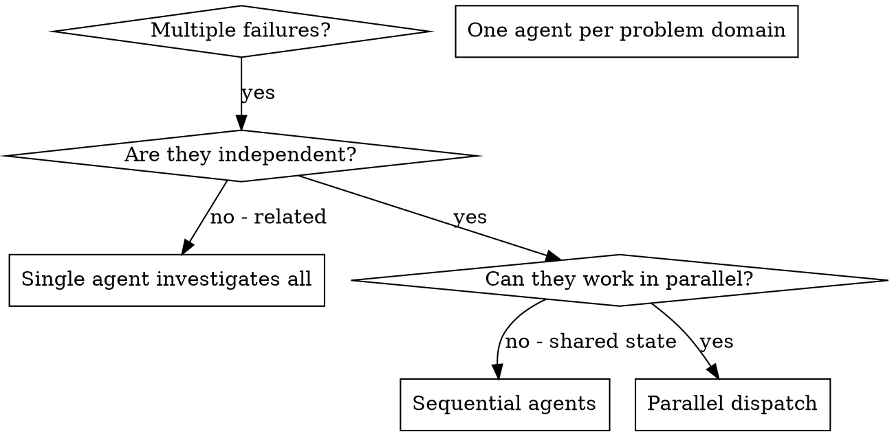

<SEARCH_DISCIPLINE>
# Search Triggers (硬触发)

> source-of-truth for `<SEARCH_DISCIPLINE>` block anchor A in all skills.
> Edits here must be followed by `./scripts/inline-search-discipline.sh` to propagate.

LLM 在以下 4 种事件发生时,**必须**先调用 web search 工具,然后才能继续:

## T1. 每事实必搜
<HARD-GATE>
在 skill 输出任何事实性陈述之前(API 行为、最佳实践、库用法、
版本兼容性、数据点、规范条款),**必须**先 web search 验证。
</HARD-GATE>

**触发判断**:
- 句子含 "Python 的 GIL 限制了多线程" → 搜 "Python GIL 2026"
- 句子含 "React 19 默认开启 server components" → 搜 "React 19 server components default"
- 句子含 "X 库比 Y 库快 N 倍" → 搜 benchmark 链接

**豁免**: 已被本 skill 之前调用结果验证过的事实可标 `[T1-VERIFIED-AT:<timestamp>]` 复用,
但 24 小时内必须重新验证。

## T2. 每决策必搜
<HARD-GATE>
在做出任何技术 / 架构 / 选型 / 模式选择前,**必须**先 search 当前最佳实践。
</HARD-GATE>

**触发判断**:
- 选 ORM / 选框架 / 选状态管理 → 搜 "best X 2026"
- 选架构模式(monorepo / microfrontend) → 搜 "X vs Y 2026"
- 选错误处理策略 → 搜 "X 错误处理 最佳实践 2026"

**豁免**: 仅当用户明确指定 "用 X" 时,无需再搜 X 是不是最好的。

## T3. 每步入口必搜
<HARD-GATE>
在 skill 流程的每一步开头,先 search 一次"该步骤主题的最新进展"再继续。
</HARD-GATE>

**适用 skill**: 流程型 skill(brainstorming / writing-plans / verification / receiving-code-review)
**豁免**: 纯机械步骤(如 git 操作、文件移动)不触发。

## T4. 每自信断言必搜
<HARD-GATE>
LLM 主动表达自信时("这个肯定..."、"我们知道..."、"明显..."、
"应该是..."、"一般来说...")**必须**先 search 来证伪自己。
</HARD-GATE>

**反幻觉**: 这是最锐的一条。LLM 最容易在"自信断言"上栽。
即使是"我刚 verify 过的事实"也要在 24h 后重新验证。
# Source Quality Rules (源选择硬规则)

> source-of-truth for `<SEARCH_DISCIPLINE>` block anchor A in all skills.

## S1. 金字塔分级

| 等级 | 类型 | 例 | 使用规则 |
|---|---|---|---|
| T1 权威 | 官方文档 / RFC / 同行评审论文 / 政府数据 | python.org, rfc-editor.org, DOI | 直接采用,无需交叉 |
| T2 知名 | 知名博客 / SO 高赞 / 行业头部公司工程博客 | kubernetes.io/blog, eng.uber.com, SO score>100 | 需 ≥1 个 T1 背书,或 ≥2 个 T2 独立 |
| T3 普通 | 论坛 / 个人博客 / AI 生成 / 营销文 | medium 个人, reddit 普通帖 | 仅作 hint,不作为依据 |

## S2. 多源交叉为硬规则
<HARD-GATE>
任何非平凡事实,必须 ≥2 独立源确认。单一源不能下定论。
</HARD-GATE>
"独立" = 不同作者 / 不同组织 / 不同时间。
单一来源(无论多权威)只能作为"候选",不能作为"定论"。

## S3. 类型广(跨域验证)
<HARD-GATE>
广范围 ≠ 数量广,要类型广: 官方 + 社区 + 学术 + 实际使用者反馈。
</HARD-GATE>
"X 库好" 需搜: 官方 + 社区评价 + benchmark + 实际用户 issue 反馈。
避免单一视角偏差(只看官方 = 营销; 只看社区 = 偏见)。

## S4. 时效性硬要求
<HARD-GATE>
依赖时间的主题,必须包含年份 / 月份 / 显式日期。
禁用: "目前"、"现在"、"现在主流"、"近期"、"通常"。
强制: "2026 年 8 月"、"截至 2026-Q2"、"2025 年 12 月发布"。
</HARD-GATE>
原因: 训练数据天然会过期,模糊时间词会掩盖时效。
# Output Format (呈现硬规则)

> source-of-truth for `<SEARCH_DISCIPLINE>` block anchor A in all skills.

## OF1. 内联引用(每次输出必须)
每个事实 / 决策 / 结论后,必须立即附 source label:

- 简单事实:`[T1:python.org/rst/...]` 或 `[T2:so.com/q/123, eng.uber.com/...]`
- 决策结论:`[DECISION:基于 T1+T2 交叉,选 X]`
- 自验证后:`[T1-VERIFIED-AT:2026-08-15T05:00:00Z]`
- 失败/冲突:`[UNVERIFIED:原因]` / `[CONFLICT:T1说X,T2说Y]`

## OF2. 结构化搜索日志(每个 skill invocation 写一份)
路径: `.superpowers-max/search-log/<skill>-<YYYY-MM-DDTHH-MM-SS>.md`

格式(强制):
```markdown
# Search Log: <skill> @ <timestamp>
session_id: <id>
skill: <skill-name>
step: <step-name>

## Queries
1. <query-1>
   - results: <N>
   - sources: [T1:url1, T2:url2]
   - used: yes/no
   - reason: <why used or skipped>

2. <query-2>
   ...

## Decisions Made
- D1: <decision>
  basis: [T1:url1, T2:url2]
  confidence: high/medium/low

## Failures
- F1: <what failed>
  fallback: <what we did instead>

## Conflicts
- C1: T1 says X, T2 says Y
  presented: yes (per failure rule C)
```

## OF3. 日志位置与保留
- 路径: `.superpowers-max/search-log/`
- 保留: 30 天(自动清理,可用 `scripts/cleanup-logs.sh`)
- 上传: 默认不上传(本地)。如要分享可手工 `git add`。
# Failure Handling (失败/冲突硬规则)

> source-of-truth for `<SEARCH_DISCIPLINE>` block anchor A in all skills.

## FM1. 多通道 fallback
<HARD-GATE>
web_search 失败 → firecrawl → MCP 学术 / 专业数据源 → 仍失败才标 [UNVERIFIED]。
不能因一个渠道死了就放弃。
</HARD-GATE>

fallback 顺序(可配置,默认如下):
1. web_search (内置)
2. firecrawl (高级抓取,需配置)
3. MCP 学术 / 金融 / 医学(专业数据源)
4. 标 [UNVERIFIED],记录于 search log

## FM2. 降级 + 显式标注
<HARD-GATE>
全部通道失败时,标 [UNVERIFIED] + 原因,可继续推进,但事后可被审查。
</HARD-GATE>

```
[UNVERIFIED:query="X", tried=web+firecrawl+mcp, reason=all_failed_or_empty]
基于训练数据,我的回答是 Y。但未能在搜索中验证。
请用户审查。
```

## FM3. 源冲突必须呈现
<HARD-GATE>
多源冲突时,LLM 必须呈现冲突各方观点,不许静默选边。
</HARD-GATE>

```
[CONFLICT:topic="X"]
- T1 (official): <观点 A>
- T2 (community): <观点 B>
我的判断: <基于 X / Y / Z 选择 A / B / 不选>
但你应知道存在 B。
```

把判断权交回用户。

</SEARCH_DISCIPLINE>

# Dispatching Parallel Agents

## Overview

You delegate tasks to specialized agents with isolated context. By precisely crafting their instructions and context, you ensure they stay focused and succeed at their task. They should never inherit your session's context or history — you construct exactly what they need. This also preserves your own context for coordination work.

When you have multiple unrelated failures (different test files, different subsystems, different bugs), investigating them sequentially wastes time. Each investigation is independent and can happen in parallel.

**Core principle:** Dispatch one agent per independent problem domain. Let them work concurrently.

## When to Use



**Use when:**
- 3+ test files failing with different root causes
- Multiple subsystems broken independently
- Each problem can be understood without context from others
- No shared state between investigations

**Don't use when:**
- Failures are related (fix one might fix others)
- Need to understand full system state
- Agents would interfere with each other

## The Pattern

<SEARCH_GATE step="task-decomposition" triggers="T2">
Before decomposing the work into parallel dispatches, you MUST:
1. T2: Web search "parallel agent task decomposition 2026" and "subagent dispatch independence criteria 2026" to confirm the upstream decomposition rubric (group failures by what's broken → one domain per agent → agent prompt specifies scope/goal/constraints/output) is still the current 2026 consensus. The shape is stable; the *boundaries* shift. A 2024 reference may have treated "different test files" as the canonical independent-domain boundary; a 2026 reference may have tightened the boundary to "different modules with no shared fixtures" (test fixtures count as shared state) or loosened it to "different concerns with interface contracts". The LLM must verify the current 2026 independence criteria, not apply 2022 defaults to a 2026 codebase. Cite at least one [T2:url] (engineering org blog / framework docs) for the current rubric.
2. T2: For the specific set of failures in front of you, search the current 2026 best practice for the *kind* of decomposition (e.g., "is grouping by file a valid independence check for 2026 parallel subagent dispatch?", "is grouping by subsystem enough or do shared schema definitions count as shared state?", "when the failures are all in one file, is the decomposition 'broken' or 'actually sequential work'?"). The upstream example groups by test file, but the LLM is most likely to either over-decompose (splitting work that is actually coupled) or under-decompose (treating a tightly coupled refactor as 3 independent fixes). The 2026 case studies calibrate the bar. Cite at least one [T2:url] (community / engineering blog) for the kind-specific decomposition check.
3. T2: For the agent-prompt structure (Specific scope / Clear goal / Constraints / Expected output), search the current 2026 best practice for what a subagent dispatch prompt must include. The upstream 4-element shape is a 2024-vintage minimum; 2026 dispatch prompts may be expected to include: a one-line "where this task fits in the project" framing, a brief-path or report-path handoff, an explicit "do not change other code" constraint (already in upstream), and an output-file contract (not just "return summary"). The LLM must verify the current prompt-shape expectations before composing the dispatch. Cite at least one [T2:url] (community / subagent-driven-development / current framework) for the prompt-shape expectations.
4. Output: log the queries + the chosen decomposition boundary (file / subsystem / module / fixture-graph) + the prompt-shape check to `.superpowers-max/search-log/dispatching-parallel-agents-<ts>.md` per OF2. The audit trail must show the decomposition was searched, not defaulted to "group by file" from training data.
</SEARCH_GATE>

### 1. Identify Independent Domains

Group failures by what's broken:
- File A tests: Tool approval flow
- File B tests: Batch completion behavior
- File C tests: Abort functionality

Each domain is independent - fixing tool approval doesn't affect abort tests.

### 2. Create Focused Agent Tasks

Each agent gets:
- **Specific scope:** One test file or subsystem
- **Clear goal:** Make these tests pass
- **Constraints:** Don't change other code
- **Expected output:** Summary of what you found and fixed

### 3. Dispatch in Parallel

<SEARCH_GATE step="file-ownership-overlap" triggers="T2">
Before issuing the parallel dispatches, you MUST:
1. T2: Web search "subagent file ownership isolation 2026" and "parallel agent shared state detection 2026" to confirm the upstream "no shared state" check (one agent per problem domain → no shared files / no shared resources / no shared fixtures) is still the current 2026 consensus. The shape is stable; the *detection mechanism* shifts. A 2024 reference may have treated "different file" as sufficient; a 2026 reference may have tightened the check to "no shared transitive dependencies" (Agent A imports module B; Agent C also imports module B → B is shared mutable state) or to "no shared test fixture, mock, or schema definition". The LLM must verify the current 2026 shared-state detection, not apply 2022 defaults to a 2026 dispatch surface. Cite at least one [T2:url] (engineering org blog / framework docs).
2. T2: For the specific dispatches about to fire, search the current 2026 best practice for *how* to detect file-ownership overlap. The upstream rule "Agents would interfere (editing same files, using same resources)" is a high-level statement; the 2026 specifics include: a static check (do any two dispatches' target paths intersect?), a transitive-import check (do any two dispatches' targets import a common module that one will modify?), a fixture check (do any two dispatches' tests share a fixture file or a setup helper?), and a runtime-resource check (do any two dispatches need exclusive access to a port / a database / a temp dir?). The LLM is most likely to detect direct overlap and miss transitive overlap (e.g., two agents both editing different files that both import a shared schema). The 2026 detection patterns are the calibration. Cite at least one [T2:url] (community / engineering blog) for the kind-specific detection.
3. T2: For the "issue all dispatches in the same response" pattern, search the current 2026 best practice for the dispatch-shape expectations. The upstream rule "Multiple dispatch calls in one response = parallel execution. One per response = sequential" is a 2024-vintage dispatch mechanic; 2026 dispatch surfaces may now expect: explicit parallelism markers (e.g., "fire these concurrently" / a parallel-tool-call construct), an isolation guarantee in the dispatch prompt ("you have exclusive access to <file path range> — coordinate with no other agent"), a per-dispatch worktree or branch name (so file writes don't collide on disk), and a kill-switch if any one dispatch corrupts shared state. The LLM must verify the current dispatch-surface expectations before issuing the dispatches. Cite at least one [T2:url] (current framework docs / engineering blog).
4. Output: log the queries + the file-ownership overlap check (static / transitive / fixture / runtime) + the dispatch-shape verification to `.superpowers-max/search-log/dispatching-parallel-agents-<ts>.md` per OF2. The audit trail must show the ownership check was searched, not defaulted to "different file = safe to parallelize" from training data.
</SEARCH_GATE>

Issue all three subagent dispatches in the same response — they run in parallel:

```text
Subagent (general-purpose): "Fix agent-tool-abort.test.ts failures"
Subagent (general-purpose): "Fix batch-completion-behavior.test.ts failures"
Subagent (general-purpose): "Fix tool-approval-race-conditions.test.ts failures"
# All three run concurrently.
```

Multiple dispatch calls in one response = parallel execution. One per response = sequential.

### 4. Review and Integrate

<SEARCH_GATE step="merge-conflict-resolution" triggers="T2,T4">
Before integrating the parallel dispatches' results, you MUST:
1. T2: Web search "parallel agent merge conflict resolution 2026" and "subagent dispatch integration conflict 2026" to confirm the upstream conflict-handling flow (read each summary → verify fixes don't conflict → run full test suite → integrate all changes) is still the current 2026 consensus. The shape is stable; the *detection strategy* shifts. A 2024 reference may have detected conflicts by reading the diffs; a 2026 reference may have promoted the conflict-detection to a structured prompt (each agent returns a "files I modified" manifest) or a static-analysis pre-check (a diff-merge tool that flags overlapping hunks before integration). The LLM must verify the current 2026 conflict-detection strategy, not apply 2022 defaults to a 2026 dispatch surface. Cite at least one [T2:url] (engineering org blog / framework docs).
2. T2: For the specific merge situation in front of you, search the current 2026 best practice for the *kind* of conflict (e.g., "is a content conflict in overlapping test files fixable by hand or does it need re-dispatch?", "is a semantic conflict — both agents rewrote the same function with different contracts — detectable from diffs alone?", "when one agent deleted code another agent imported, is that a content conflict or a semantic conflict that needs human adjudication?"). Each kind has a current 2026 resolution strategy. The LLM is most likely to apply the same "merge hunks manually" recipe to all of them and miss the kind-specific resolution. Search the kind before choosing the resolution. Cite at least one [T2:url] (community / engineering blog) for the kind-specific resolution.
3. T2: For the "run full test suite" verification, search the current 2026 best practice for the post-integration test surface. The upstream rule ("run the full test suite after integration") is a 2024-vintage minimum; 2026 verification may be expected to include: per-domain test runs in isolation (not just full suite — to catch "passes in isolation, fails together" races), cross-domain integration tests (the contract between the parallel agents), and a final whole-branch review (dispatching on the most capable model — the same model-selection discipline as subagent-driven-development). The LLM must verify the current verification-shape expectations before declaring integration complete. Cite at least one [T2:url] (current framework / engineering blog).
4. T4: The "agents didn't conflict because I checked ownership before dispatch" reflex is a confidence assertion. Before declaring integration complete, search the current 2026 evidence on the *base rate* of conflicts in well-decomposed parallel dispatches (e.g., "what fraction of well-decomposed parallel agent dispatches produce a conflict on integration in 2026?"). The LLM's training data is biased toward "I checked, so no conflict" — a heuristic that ignores the kinds of conflicts that ownership checks don't catch (semantic conflicts where both agents produced different but compatible-looking diffs, transient-file conflicts where both agents wrote to the same temp path with the same name, test-order conflicts where one agent's test now runs before another's fixture is set up). The current 2026 data on conflict base rates is the calibration: the LLM must run the verification, not skip it on the basis of "I checked". If the verification surfaces a conflict the ownership check didn't predict, surface as [CONFLICT] and treat the ownership-check rubric as needing a tighter version.
5. Output: log the queries + the conflict-detection strategy used + the kind-specific resolution + the base-rate check + the verification result to `.superpowers-max/search-log/dispatching-parallel-agents-<ts>.md` per OF2. The audit trail must show the conflict resolution was searched, not defaulted to "agents worked on different files, so no conflict" from training data.
</SEARCH_GATE>

When agents return:
- Read each summary
- Verify fixes don't conflict
- Run full test suite
- Integrate all changes

## Agent Prompt Structure

Good agent prompts are:
1. **Focused** - One clear problem domain
2. **Self-contained** - All context needed to understand the problem
3. **Specific about output** - What should the agent return?

```markdown
Fix the 3 failing tests in src/agents/agent-tool-abort.test.ts:

1. "should abort tool with partial output capture" - expects 'interrupted at' in message
2. "should handle mixed completed and aborted tools" - fast tool aborted instead of completed
3. "should properly track pendingToolCount" - expects 3 results but gets 0

These are timing/race condition issues. Your task:

1. Read the test file and understand what each test verifies
2. Identify root cause - timing issues or actual bugs?
3. Fix by:
   - Replacing arbitrary timeouts with event-based waiting
   - Fixing bugs in abort implementation if found
   - Adjusting test expectations if testing changed behavior

Do NOT just increase timeouts - find the real issue.

Return: Summary of what you found and what you fixed.
```

## Common Mistakes

**❌ Too broad:** "Fix all the tests" - agent gets lost
**✅ Specific:** "Fix agent-tool-abort.test.ts" - focused scope

**❌ No context:** "Fix the race condition" - agent doesn't know where
**✅ Context:** Paste the error messages and test names

**❌ No constraints:** Agent might refactor everything
**✅ Constraints:** "Do NOT change production code" or "Fix tests only"

**❌ Vague output:** "Fix it" - you don't know what changed
**✅ Specific:** "Return summary of root cause and changes"

## When NOT to Use

**Related failures:** Fixing one might fix others - investigate together first
**Need full context:** Understanding requires seeing entire system
**Exploratory debugging:** You don't know what's broken yet
**Shared state:** Agents would interfere (editing same files, using same resources)

## Real Example from Session

**Scenario:** 6 test failures across 3 files after major refactoring

**Failures:**
- agent-tool-abort.test.ts: 3 failures (timing issues)
- batch-completion-behavior.test.ts: 2 failures (tools not executing)
- tool-approval-race-conditions.test.ts: 1 failure (execution count = 0)

**Decision:** Independent domains - abort logic separate from batch completion separate from race conditions

**Dispatch:**
```
Agent 1 → Fix agent-tool-abort.test.ts
Agent 2 → Fix batch-completion-behavior.test.ts
Agent 3 → Fix tool-approval-race-conditions.test.ts
```

**Results:**
- Agent 1: Replaced timeouts with event-based waiting
- Agent 2: Fixed event structure bug (threadId in wrong place)
- Agent 3: Added wait for async tool execution to complete

**Integration:** All fixes independent, no conflicts, full suite green

## Verification

After agents return:
1. **Review each summary** - Understand what changed
2. **Check for conflicts** - Did agents edit same code?
3. **Run full suite** - Verify all fixes work together
4. **Spot check** - Agents can make systematic errors
