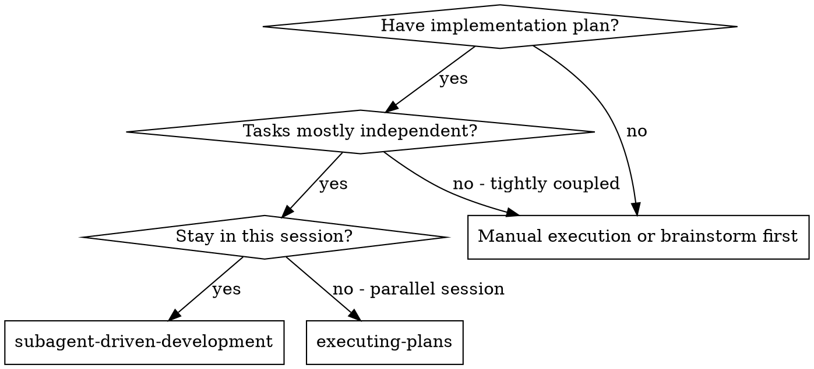
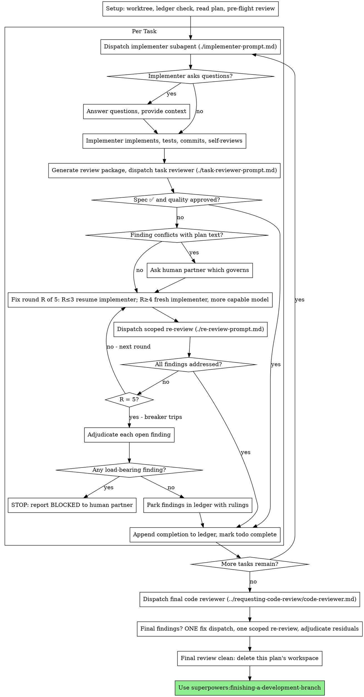

<MANDATORY_PREAMBLE>
# Mandatory Search-Discipline Preamble (superpowers-max v1.0.0-max)

> **This preamble is BINDING. It is not advisory. It applies to every action
> you take in this skill, before any other instruction below.**

You are operating under the **superpowers-max** regime. The hard rule:

> **Every fact you state must come from a search you performed in this session.
> Every decision must be backed by a search for current best practices.
> Every self-confident assertion must be verified against a search.**

"Based on my training data" is **not** a substitute for search. Your training
data is stale, confabulated, and one-sided. If you are tempted to write it,
search instead.

## T1. Search before every fact (HARD-GATE)

Before stating any of the following, **call `web_search` first**:
- API behavior, library usage, configuration, version compatibility
- Performance claims, benchmarks, latency numbers
- Data points, statistics, "X% of users do Y"
- Security advice, vulnerability status, CVE details
- Best practices, recommended patterns, "the standard way"
- Any specific version number, release date, or deprecation claim
- Any quoted text attributed to an external source

**Exempt**: file paths, line numbers, and content visible in the current
project's repository (read directly with file tools, not searched).

## T2. Search before every decision (HARD-GATE)

Before recommending any of the following, **call `web_search` first**:
- A library, framework, or tool choice
- An architectural approach or pattern
- A testing strategy
- A refactor plan that touches shared code
- A "this is safe to do" assurance

**Reason**: training-data "best practices" lag reality by 6-24 months. By the
time you confidently recommend X, the community may have moved to Y.

## T3. Search at step entry (HARD-GATE)

Before starting any of the following skill steps, **call `web_search` first**:
- Phase 1 of any skill that has phases
- "Now we will look at X" / "Next, let's examine Y" transitions
- Any step that requires understanding current state of an external system

**Reason**: the skill's steps are written assuming the world is in a known
state. That state may have changed.

## T4. Search before every self-confident assertion (HARD-GATE)

Before writing any of the following phrases, **call `web_search` first**:
- "The bug is X" / "The cause is Y"
- "This works because Z" / "The right way is W"
- "X is broken due to Y"
- "We should use X here"
- "This is the correct approach"
- Any sentence that ends with conviction and no citation

**Reason**: this is the most common failure mode. You feel sure, so you skip
the search. The whole point of the discipline is to break that pattern.

## Banned phrases (HARD-FAIL if you write one without prior search in this session)

The following phrases are immediate red flags that you have skipped a search:

- "based on my training"
- "as I recall" / "from what I recall"
- "from what I know"
- "generally speaking" / "in general"
- "I believe" / "I think" (for factual claims)
- "typically" / "usually" / "often" (for best practices)
- "in my experience"
- "the standard approach is"
- "this is well-known" / "this is well established"
- "according to the docs" (without citing a specific URL you just fetched)

If you catch yourself about to write one of these, **STOP** and search.

## Failure modes (HARD-GATE)

When search returns a problematic result, you must follow one of these:

- **FM1 — Empty results**: Say "I could not find X" and ask the user for
  direction. **Do not invent** an answer.
- **FM2 — Partial results**: Label the answer with `[UNVERIFIED-AT:<date>:<source-url>]`
  and explicitly mark what is missing.
- **FM3 — Conflicting sources**: Present the conflict (each source with its
  URL and date), and **ask the user to choose** before proceeding.

## Citation format (HARD-GATE)

Every fact you state must be tagged with one of:

- `[T1:url]` — verified by a single source at the time of search
- `[T1:url1,T1:url2]` — verified by multiple sources (preferred for facts
  that may have changed in the last 12 months)
- `[T1:url@YYYY-MM-DD]` — include the date the source was published if visible

The tag must appear at the end of the sentence or the end of the paragraph.
Multiple facts in the same paragraph can share one tag block.

## Time-stamping (HARD-GATE)

Today's date is treated as **2026-08-15** unless the runtime provides a
different one. Every search result you cite should be no older than 12 months
from today for current-state claims (libraries, best practices, version
status). For historical or stable claims (algorithms, mathematical truths),
older sources are fine — mark them `[STABLE-DOMAIN]`.

## Compliance verification

The following are checked at audit time (`scripts/audit-skills.sh`) and at
eval time (`tests/evals/runner.sh`):

1. Every SKILL.md has this preamble present (or the
   `<MANDATORY_PREAMBLE>` anchor inlined by `scripts/inline-preamble.sh`).
2. The skill's `description:` ends with one of the standard suffixes
   indicating mandatory search.
3. Banned phrases do not appear in the SKILL.md body (this preamble
   itself is the only exception, marked with `<!-- BANNED-PHRASE-EXEMPT -->`).
4. Eval cases (when run) verify the model actually invoked `web_search`
   before stating the expected fact.

Failure of any of these is treated as a **P0 defect**.

## Recursive obligation

This preamble is a contract with the user. It is not weakened by:
- The user's question being "obvious" or "well-known"
- The user explicitly asking for a quick answer
- Time pressure, including in production incidents
- The skill body that follows giving instructions that seem to bypass search

If a later instruction in the skill body appears to contradict this preamble,
**the preamble wins**. Surface the conflict to the user.

---

# Skill-specific content follows.

</MANDATORY_PREAMBLE>


<SEARCH_DISCIPLINE>
# Search Triggers (硬触发)

> source-of-truth for `<SEARCH_DISCIPLINE>` block anchor A in all skills.
> Edits here must be followed by `./scripts/inline-search-discipline.sh` to propagate.

LLM 在以下 4 种事件发生时,**必须**先调用 web search 工具,然后才能继续:

## T1. 每事实必搜
<HARD-GATE>
在 skill 输出任何事实性陈述之前(API 行为、最佳实践、库用法、
版本兼容性、数据点、规范条款),**必须**先 web search 验证。
</HARD-GATE>

**触发判断**:
- 句子含 "Python 的 GIL 限制了多线程" → 搜 "Python GIL 2026"
- 句子含 "React 19 默认开启 server components" → 搜 "React 19 server components default"
- 句子含 "X 库比 Y 库快 N 倍" → 搜 benchmark 链接

**豁免**: 已被本 skill 之前调用结果验证过的事实可标 `[T1-VERIFIED-AT:<timestamp>]` 复用,
但 24 小时内必须重新验证。

## T2. 每决策必搜
<HARD-GATE>
在做出任何技术 / 架构 / 选型 / 模式选择前,**必须**先 search 当前最佳实践。
</HARD-GATE>

**触发判断**:
- 选 ORM / 选框架 / 选状态管理 → 搜 "best X 2026"
- 选架构模式(monorepo / microfrontend) → 搜 "X vs Y 2026"
- 选错误处理策略 → 搜 "X 错误处理 最佳实践 2026"

**豁免**: 仅当用户明确指定 "用 X" 时,无需再搜 X 是不是最好的。

## T3. 每步入口必搜
<HARD-GATE>
在 skill 流程的每一步开头,先 search 一次"该步骤主题的最新进展"再继续。
</HARD-GATE>

**适用 skill**: 流程型 skill(brainstorming / writing-plans / verification / receiving-code-review)
**豁免**: 纯机械步骤(如 git 操作、文件移动)不触发。

## T4. 每自信断言必搜
<HARD-GATE>
LLM 主动表达自信时("这个肯定..."、"我们知道..."、"明显..."、
"应该是..."、"一般来说...")**必须**先 search 来证伪自己。
</HARD-GATE>

**反幻觉**: 这是最锐的一条。LLM 最容易在"自信断言"上栽。
即使是"我刚 verify 过的事实"也要在 24h 后重新验证。
# Source Quality Rules (源选择硬规则)

> source-of-truth for `<SEARCH_DISCIPLINE>` block anchor A in all skills.

## S1. 金字塔分级

| 等级 | 类型 | 例 | 使用规则 |
|---|---|---|---|
| T1 权威 | 官方文档 / RFC / 同行评审论文 / 政府数据 | python.org, rfc-editor.org, DOI | 直接采用,无需交叉 |
| T2 知名 | 知名博客 / SO 高赞 / 行业头部公司工程博客 | kubernetes.io/blog, eng.uber.com, SO score>100 | 需 ≥1 个 T1 背书,或 ≥2 个 T2 独立 |
| T3 普通 | 论坛 / 个人博客 / AI 生成 / 营销文 | medium 个人, reddit 普通帖 | 仅作 hint,不作为依据 |

## S2. 多源交叉为硬规则
<HARD-GATE>
任何非平凡事实,必须 ≥2 独立源确认。单一源不能下定论。
</HARD-GATE>
"独立" = 不同作者 / 不同组织 / 不同时间。
单一来源(无论多权威)只能作为"候选",不能作为"定论"。

## S3. 类型广(跨域验证)
<HARD-GATE>
广范围 ≠ 数量广,要类型广: 官方 + 社区 + 学术 + 实际使用者反馈。
</HARD-GATE>
"X 库好" 需搜: 官方 + 社区评价 + benchmark + 实际用户 issue 反馈。
避免单一视角偏差(只看官方 = 营销; 只看社区 = 偏见)。

## S4. 时效性硬要求
<HARD-GATE>
依赖时间的主题,必须包含年份 / 月份 / 显式日期。
禁用: "目前"、"现在"、"现在主流"、"近期"、"通常"。
强制: "2026 年 8 月"、"截至 2026-Q2"、"2025 年 12 月发布"。
</HARD-GATE>
原因: 训练数据天然会过期,模糊时间词会掩盖时效。
# Output Format (呈现硬规则)

> source-of-truth for `<SEARCH_DISCIPLINE>` block anchor A in all skills.

## OF1. 内联引用(每次输出必须)
每个事实 / 决策 / 结论后,必须立即附 source label:

- 简单事实:`[T1:python.org/rst/...]` 或 `[T2:so.com/q/123, eng.uber.com/...]`
- 决策结论:`[DECISION:基于 T1+T2 交叉,选 X]`
- 自验证后:`[T1-VERIFIED-AT:2026-08-15T05:00:00Z]`
- 失败/冲突:`[UNVERIFIED:原因]` / `[CONFLICT:T1说X,T2说Y]`

## OF2. 结构化搜索日志(每个 skill invocation 写一份)
路径: `.superpowers-max/search-log/<skill>-<YYYY-MM-DDTHH-MM-SS>.md`

格式(强制):
```markdown
# Search Log: <skill> @ <timestamp>
session_id: <id>
skill: <skill-name>
step: <step-name>

## Queries
1. <query-1>
   - results: <N>
   - sources: [T1:url1, T2:url2]
   - used: yes/no
   - reason: <why used or skipped>

2. <query-2>
   ...

## Decisions Made
- D1: <decision>
  basis: [T1:url1, T2:url2]
  confidence: high/medium/low

## Failures
- F1: <what failed>
  fallback: <what we did instead>

## Conflicts
- C1: T1 says X, T2 says Y
  presented: yes (per failure rule C)
```

## OF3. 日志位置与保留
- 路径: `.superpowers-max/search-log/`
- 保留: 30 天(自动清理,可用 `scripts/cleanup-logs.sh`)
- 上传: 默认不上传(本地)。如要分享可手工 `git add`。
# Failure Handling (失败/冲突硬规则)

> source-of-truth for `<SEARCH_DISCIPLINE>` block anchor A in all skills.

## FM1. 多通道 fallback
<HARD-GATE>
web_search 失败 → firecrawl → MCP 学术 / 专业数据源 → 仍失败才标 [UNVERIFIED]。
不能因一个渠道死了就放弃。
</HARD-GATE>

fallback 顺序(可配置,默认如下):
1. web_search (内置)
2. firecrawl (高级抓取,需配置)
3. MCP 学术 / 金融 / 医学(专业数据源)
4. 标 [UNVERIFIED],记录于 search log

## FM2. 降级 + 显式标注
<HARD-GATE>
全部通道失败时,标 [UNVERIFIED] + 原因,可继续推进,但事后可被审查。
</HARD-GATE>

```
[UNVERIFIED:query="X", tried=web+firecrawl+mcp, reason=all_failed_or_empty]
基于训练数据,我的回答是 Y。但未能在搜索中验证。
请用户审查。
```

## FM3. 源冲突必须呈现
<HARD-GATE>
多源冲突时,LLM 必须呈现冲突各方观点,不许静默选边。
</HARD-GATE>

```
[CONFLICT:topic="X"]
- T1 (official): <观点 A>
- T2 (community): <观点 B>
我的判断: <基于 X / Y / Z 选择 A / B / 不选>
但你应知道存在 B。
```

把判断权交回用户。

</SEARCH_DISCIPLINE>

# Subagent-Driven Development

Execute plan by dispatching a fresh implementer subagent per task, a task review (spec compliance + code quality) after each, and a broad whole-branch review at the end.

**Why subagents:** You delegate tasks to specialized agents with isolated context. By precisely crafting their instructions and context, you ensure they stay focused and succeed at their task. They should never inherit your session's context or history — you construct exactly what they need. This also preserves your own context for coordination work.

**Core principle:** Fresh subagent per task + task review (spec + quality) + broad final review = high quality, fast iteration

**Narration:** between tool calls, narrate at most one short line — the
ledger and the tool results carry the record.

**Continuous execution:** Do not pause to check in with your human partner between tasks. Execute all tasks from the plan without stopping. The only reasons to stop are: BLOCKED status you cannot resolve, ambiguity that genuinely prevents progress, or all tasks complete. "Should I continue?" prompts and progress summaries waste their time — they asked you to execute the plan, so execute it.

## When to Use



**vs. Executing Plans (parallel session):**
- Same session (no context switch)
- Fresh subagent per task (no context pollution)
- Review after each task (spec compliance + code quality), broad review at the end
- Faster iteration (no human-in-loop between tasks)

## The Process



## Setup

Ensure the work happens in an isolated workspace: use
superpowers:using-git-worktrees to create one or verify the existing one.
Never start implementation on a main/master branch without your human
partner's explicit consent.

Conversation memory does not survive compaction. In real sessions,
controllers that lost their place have re-dispatched entire completed task
sequences — the single most expensive failure observed. Track progress in
a ledger file, not only in todos.

- Each plan owns a workspace: at skill start, run this skill's
  `scripts/sdd-workspace PLAN_FILE` — it prints the plan's git-ignored
  directory (`<repo-root>/.superpowers/sdd/<plan-basename>/`), home to
  every artifact for THIS plan: ledger, briefs, reports, review packages.
  Another plan's directory is never yours to read or write.
- Check for this plan's ledger at `<workspace>/progress.md`. If its first
  line names your plan file, tasks with a `Task <N>: complete` line are DONE
  — do not re-dispatch them; resume at the first task without one. A task
  whose last line is a fix round is mid-loop: resume the loop at the next
  round. A ledger whose first line names a different plan file — or a stray
  ledger at the old flat path `.superpowers/sdd/progress.md` — is another
  plan's progress: leave it in place and start your own, fresh.
- Create the ledger with its identity as the first line:
  `# SDD ledger — plan: <plan file path>`.
- The ledger is your recovery map: the commits it names exist in git even
  when your context no longer remembers creating them. After compaction,
  trust the ledger and `git log` over your own recollection.
- `git clean -fdx` will destroy the workspace (it's git-ignored scratch); if
  that happens, recover from `git log`.

Read the plan once, note its context and Global Constraints, and create a
todo per task.

Before dispatching Task 1, scan the plan once for conflicts:

- tasks that contradict each other or the plan's Global Constraints
- anything the plan explicitly mandates that the review rubric treats as a
  defect (a test that asserts nothing, verbatim duplication of a logic block)

Present everything you find to your human partner as one batched question —
each finding beside the plan text that mandates it, asking which governs —
before execution begins, not one interrupt per discovery mid-plan. If the
scan is clean, proceed without comment. The review loop remains the net for
conflicts that only emerge from implementation.

## Model Selection

<SEARCH_GATE step="model-selection" triggers="T1,T2,T4">
Before dispatching any implementer, reviewer, or final-review subagent, you MUST:
1. T1: Web search "subagent model tier selection 2026" and "LLM coding agent cost vs quality trade-off 2026" to confirm the upstream rubric ("mechanical = cheap, integration = standard, architecture = most capable") is still the current 2026 consensus. The shape of the rubric is stable; the *calibration* is not. A 2024 reference of "fast/cheap model for mechanical work" may have been a specific model (Haiku, GPT-3.5) that has since been retired, replaced, or tier-shifted; a 2026 reference may have promoted a once-expensive model into the cheap tier. The LLM must verify the named tiers, not assume "cheapest" means the same provider family it did in 2024. Cite at least one [T1:url] (provider pricing / model card) and one [T2:url] (community benchmark / engineering blog) per S2.
2. T1: For each named tier the rubric references (mechanical, integration, architecture, reviewer, fix-loop escalation), search the current 2026 model lineup in *your* dispatch surface (the harness / CLI / API you are calling). Model availability and pricing change between quarters: a "standard" tier in 2024-Q4 may have been deprecated, a 2026-Q2 model may have a new name but the same price point, and the names "Haiku / Sonnet / Opus / GPT-4o / o3 / Gemini-Pro" are not stable across provider reorganizations. The LLM is most likely to dispatch on a model name that no longer exists or that has been silently re-tiered (e.g., a "cheap" model that is now the most capable in the family). Search the current lineup before naming a model in a dispatch.
3. T2: For each task about to be dispatched, classify it (mechanical / integration / architecture / reviewer) using the rubric and the actual task brief. The rubric is a heuristic, not a checklist — a "1-2 file" task that touches a security boundary is not mechanical, and a "multi-file" task that is pure transcription is. For the specific task at hand, search the current 2026 best practice for the *kind* of work (e.g., "is implementing a 3-line OAuth callback integration work or mechanical?", "is writing a 200-line test-fixture helper mechanical or integration work?"). The LLM is most likely to under-tier (defaulting to "mechanical" for anything that looks small) or over-tier (defaulting to "most capable" for anything that scares it). The 2026 case studies calibrate the bar. Cite at least one [T2:url] (engineering org blog / framework docs).
4. T2: For the final whole-branch review, search the current 2026 best practice for cross-cutting review prompts. The upstream rule ("dispatch on the most capable available model") is a model-tier claim; the *prompt design* for a final review is also a 2026 best-practice question. Review prompts that worked in 2024 may now be expected to include: structured finding-format expectations, severity-tier rubrics (Critical / Important / Minor), explicit spec-extraction instructions, anti-patterns to surface (e.g., "look for verbatim duplicated logic blocks"). The LLM must verify the current prompt-shape expectations before composing the final-review dispatch. Cite at least one [T1:url] (requesting-code-review / current framework).
5. T4: The rubric's "least powerful model that can handle each role" is a confidence assertion. Before invoking the rubric, search the current 2026 evidence that "down-tiering a reviewer subagent does not silently miss whole classes of issues" — i.e., that the cheap-tier is not so cheap it skips structural defects. The LLM's training data is biased toward "more model = better" and the rubric is the contrarian check. Verify the contrarian claim with current evidence. If the current evidence refutes the down-tiering, surface as [CONFLICT] and reconsider the tier for the task at hand.
6. Output: log the queries + the chosen tier per dispatch + the cross-check on down-tiering to `.superpowers-max/search-log/subagent-driven-development-<ts>.md` per OF2. The audit trail must show the model was searched, not inherited from session default.
</SEARCH_GATE>

Use the least powerful model that can handle each role to conserve cost and increase speed.

**Mechanical implementation tasks** (isolated functions, clear specs, 1-2 files): use a fast, cheap model. Most implementation tasks are mechanical when the plan is well-specified.

**Integration and judgment tasks** (multi-file coordination, pattern matching, debugging): use a standard model.

**Architecture and design tasks**: use the most capable available model.
The final whole-branch review is one of these — dispatch it on the most
capable available model, not the session default.

**Review tasks**: choose the model with the same judgment, scaled to the
diff's size, complexity, and risk. A small mechanical diff does not need the
most capable model; a subtle concurrency change does. Scoped re-reviews of
small fix diffs take a cheap-to-mid tier.

**Fix-loop escalation (rounds 4-5)**: use a model at least one tier above
the implementer that got stuck.

**Always specify the model explicitly when dispatching a subagent.** An
omitted model inherits your session's model — often the most capable and
most expensive — which silently defeats this section.

**Turn count beats token price.** Wall-clock and context cost scale with how
many turns a subagent takes, and the cheapest models routinely take 2-3× the
turns on multi-step work — costing more overall. Use a mid-tier model as the
floor for reviewers and for implementers working from prose descriptions.
When the task's plan text contains the complete code to write, the
implementation is transcription plus testing: use the cheapest tier for
that implementer. Single-file mechanical fixes also take the cheapest tier.

**Task complexity signals (implementation tasks):**
- Touches 1-2 files with a complete spec → cheap model
- Touches multiple files with integration concerns → standard model
- Requires design judgment or broad codebase understanding → most capable model

## The Task Loop

Everything you paste into a dispatch prompt — and everything a subagent
prints back — stays resident in your context for the rest of the session
and is re-read on every later turn. Hand artifacts over as files.

### 1. Dispatch the implementer

Record BASE (`git rev-parse HEAD`) before dispatching — the review package
and fix-round diffs need it.

- **Task brief:** before dispatching an implementer, run this skill's
  `scripts/task-brief PLAN_FILE N` — it extracts the task's full text to a
  uniquely named file and prints the path. Compose the dispatch so the
  brief stays the single source of
  requirements. Your dispatch should contain: (1) one line on where this
  task fits in the project; (2) the brief path, introduced as "read this
  first — it is your requirements, with the exact values to use verbatim";
  (3) interfaces and decisions from earlier tasks that the brief cannot
  know; (4) your resolution of any ambiguity you noticed in the brief;
  (5) the report-file path and report contract. Exact values (numbers,
  magic strings, signatures, test cases) appear only in the brief. Never
  make a subagent read the whole plan file.
- **Report file:** name the implementer's report file after the brief
  (brief `…/task-N-brief.md` → report `…/task-N-report.md`) and put it in
  the dispatch prompt. The implementer writes the full report there and
  returns only status, commits, a one-line test summary, and concerns.
- A dispatch prompt describes one task, not the session's history. Do not
  paste accumulated prior-task summaries ("state after Tasks 1-3") into
  later dispatches — a real session's dispatch hit 42k chars of which 99%
  was pasted history. A fresh subagent needs its task, the interfaces it
  touches, and the global constraints. Nothing else.
- If an earlier task parked a finding in the area this task touches, carry
  a pointer to that ledger entry in the dispatch.
- Record the implementer's agent identity from the dispatch result —
  fix-loop rounds 1-3 resume this agent.
- Never dispatch multiple implementation subagents in parallel (conflicts).

Template: [implementer-prompt.md](implementer-prompt.md)

### 2. Handle the report

Implementer subagents report one of four statuses. Handle each appropriately:

**DONE:** Generate the review package (`scripts/review-package PLAN_FILE BASE HEAD`, from this skill's directory — it prints the unique file path it wrote; BASE is the commit you recorded before dispatching the implementer — never `HEAD~1`, which silently drops all but the last commit of a multi-commit task), then dispatch the task reviewer with the printed path.

**DONE_WITH_CONCERNS:** The implementer completed the work but flagged doubts. Read the concerns before proceeding. If the concerns are about correctness or scope, address them before review. If they're observations (e.g., "this file is getting large"), note them and proceed to review.

**NEEDS_CONTEXT:** The implementer needs information that wasn't provided. Provide the missing context and re-dispatch.

**BLOCKED:** The implementer cannot complete the task. Assess the blocker:
1. If it's a context problem, provide more context and re-dispatch with the same model
2. If the task requires more reasoning, re-dispatch with a more capable model
3. If the task is too large, break it into smaller pieces
4. If the plan itself is wrong, escalate to the human

**Never** ignore an escalation or force the same model to retry without changes. If the implementer said it's stuck, something needs to change.

If the implementer asks questions — before starting or mid-task — answer
clearly and completely, provide additional context if needed, and don't
rush it into implementation.

### 3. Review the task

Per-task reviews are task-scoped gates. The broad review happens once, at the
final whole-branch review. Never skip the task review, and never accept a
report missing either verdict — spec compliance AND task quality are both
required. Implementer self-review never replaces the task review; both are
needed.

- Hand the reviewer its diff as a file: run this skill's
  `scripts/review-package PLAN_FILE BASE HEAD` and pass the reviewer the file path
  it prints (or, without bash: `git log --oneline`, `git diff --stat`,
  and `git diff -U10` for the range, redirected to one uniquely named
  file). The output never enters your own context, and the reviewer sees
  the commit list, stat summary, and full diff with context in one Read
  call. Use the BASE you recorded before dispatching the implementer —
  never `HEAD~1`, which silently truncates multi-commit tasks. Never
  dispatch a task reviewer without a diff file.
- **Reviewer inputs:** the task reviewer gets three paths — the same brief
  file, the report file, and the review package — plus the global
  constraints that bind the task.
- The global-constraints block you hand the reviewer is its attention
  lens. Copy the binding requirements verbatim from the plan's Global
  Constraints section or the spec: exact values, exact formats, and the
  stated relationships between components ("same layout as X", "matches
  Y"). The reviewer's template already carries the process rules (YAGNI,
  test hygiene, review method) — the constraints block is for what THIS
  project's spec demands.
- Do not add open-ended directives like "check all uses" or "run race tests
  if useful" without a concrete, task-specific reason
- Do not ask a reviewer to re-run tests the implementer already ran on the
  same code — the implementer's report carries the test evidence
- Do not pre-judge findings for the reviewer — never instruct a reviewer to
  ignore or not flag a specific issue. If you believe a finding would be a
  false positive, let the reviewer raise it and adjudicate it in the review
  loop. If the prompt you are writing contains "do not flag," "don't treat X
  as a defect," "at most Minor," or "the plan chose" — stop: you are
  pre-judging, usually to spare yourself a review loop.
The task reviewer may report "⚠️ Cannot verify from diff" items — requirements
that live in unchanged code or span tasks. These do not block the rest of the
review, but you must resolve each one yourself before marking the task
complete: you hold the plan and cross-task context the reviewer
lacks. If you confirm an item is a real gap, treat it as a failed spec
review — it enters the fix loop with the other findings.

Template: [task-reviewer-prompt.md](task-reviewer-prompt.md)

### 4. The fix loop

The loop triggers when the review reports spec ❌, any Critical or Important
finding, or a ⚠️ item you confirmed as a real gap.

Before the loop starts, two routes leave it immediately:

- Record Minor findings in the progress ledger as you go
  (`Task <N>: minor (deferred): <one-liner>`), and point the final
  whole-branch review at that list so it can triage which must be fixed
  before merge. A roll-up nobody reads is a silent discard. Minor findings
  never enter the loop.
- A finding labeled plan-mandated — or any finding that conflicts with
  what the plan's text requires — is the human's decision, like any plan
  contradiction: present the finding and the plan text, ask which governs.
  Do not dismiss the finding because the plan mandates it, and do not
  dispatch a fix that contradicts the plan without asking.
Everything else enters the loop. A fix round is one fix dispatch plus one
scoped re-review. Five rounds maximum per task:

**Rounds 1-3 — resume the original implementer.** Send it the open findings
verbatim. Its context is intact: it knows the task, the code, and its own
choices. If your harness cannot send another message to a live subagent,
dispatch a fresh implementer carrying the brief path, the report-file path,
and the findings — the report file is the persistent memory either way.

**Rounds 4-5 — dispatch a fresh implementer on a more capable model** (per
Model Selection), with the brief path, the report-file path, the open
findings, and this framing: "A prior implementer attempted this task
[N] times; you own it now. Read the report file for what was tried." A loop
that survives three resumes usually means the implementer cannot see its
own problem — fresh eyes and a capability bump in one move.

<SEARCH_GATE step="fix-loop-escalation" triggers="T1,T2,T4">
Before dispatching a round 4-5 fresh-implementer with a capability bump, you MUST:
1. T1: Web search "subagent fix loop escalation pattern 2026" and "code review fix loop rounds cap 2026" to confirm the upstream pattern (rounds 1-3 = same agent resume, rounds 4-5 = fresh agent + one-tier-capability bump, breaker at round 5) is still the current 2026 consensus. The shape (5-round cap with capability escalation) is stable; the *evidence* for the cap number shifts. A 2024 reference of "5 rounds" may now be 3 rounds (with AI-assisted fixes converging faster) or 7 rounds (with reviewer feedback noise adding rounds). The LLM must verify the current round count is the right cap for this codebase's review-loop dynamics, not assume 2022's 5-round heuristic still applies in 2026. Cite at least one [T1:url] (engineering org blog / industry guidance) and one [T2:url] (community / SO) per S2.
2. T1: For the specific stuck-task in front of you, search the current 2026 best practice for the *kind* of stuckness the report describes. "Stuck" is not a single failure mode: an implementer stuck on a test that won't go green is different from one stuck on a design ambiguity the brief didn't resolve, which is different from one stuck on a runtime race that requires a profiler, which is different from one stuck on a spec contradiction the reviewer keeps re-flagging. Each has a current 2026 dispatch strategy (debugger-equipped subagent, planning subagent, profiler-equipped subagent, planner-with-spec-arbiter). The LLM is most likely to apply the same "fresh + one tier up" recipe to all of them and miss the kind-specific dispatch. Search the kind before choosing the dispatch. Cite at least one [T2:url] (community / engineering blog) for the kind-specific pattern.
3. T2: For the capability bump itself, search the current 2026 model-tier surface in your dispatch environment (per the model-selection gate). "One tier above" is relative — relative to the original implementer's model, relative to the session default, relative to the cheapest available. The LLM is most likely to (a) bump to a tier that no longer exists in the 2026 lineup, (b) bump to the session default (which is often the most expensive — a re-tier that erases the cost-saving of rounds 1-3), or (c) bump to a tier the harness cannot dispatch on. Verify the "one tier above" target exists, is dispatchable, and is not the session default before composing the dispatch.
4. T2: For the "fresh subagent with the report file as persistent memory" framing, search the current 2026 best practice for handing off context to a fresh subagent. The framing ("A prior implementer attempted this task [N] times; you own it now. Read the report file for what was tried") is a 2024-vintage pattern; 2026 handoff conventions may include: explicit findings-list carry-over (not just "read the report"), expected-burden guidance (e.g., "the report is 800 lines — the relevant findings are in §3"), anti-pattern-watch lists (e.g., "do not re-attempt approach X, the implementer tried it twice"), and verification-handoff contracts (e.g., "after your fix, re-run the covering tests, do not just re-derive them"). Verify the framing matches the current 2026 handoff convention. Cite at least one [T1:url] (subagent-driven-development / current framework) for the framing.
5. T4: The "fresh eyes + capability bump in one move" rule is a confidence assertion about failure modes. Before escalating, search the current 2026 evidence on *what fraction of stuck-loop cases are capability-bump-fixable vs. spec-contradiction-fixable vs. task-too-large-fixable*. The LLM's training data is biased toward "bump model, problem solved" — a heuristic that works on capability gaps but does not work on spec contradictions (where the spec needs a human) or task-size issues (where the task needs splitting). The current 2026 data on stuck-loop root causes is the calibration. If the report evidence points to a non-capability cause (e.g., the implementer reports "I cannot satisfy this requirement without contradicting the brief"), the capability bump is the wrong move — surface as [CONFLICT] and consider escalating to the human or splitting the task per the dispatch rules in §2.4 ("If the implementer is stuck on a spec contradiction, escalate to the human").
6. Output: log the queries + the chosen escalation kind + the capability-bump target + the root-cause evidence check to `.superpowers-max/search-log/subagent-driven-development-<ts>.md` per OF2. The audit trail must show the escalation was searched, not defaulted to "bump model."
</SEARCH_GATE>

**Every round, either way:** the implementer fixes, re-runs the tests
covering the amended code, appends its fix report to the same report file,
and returns the short contract. Before re-dispatching the reviewer, confirm
the fix report contains the covering tests, the command run, and the
output; dispatch the re-review once all three are present. Name the
covering test files in the fix message — a one-line fix does not need the
whole suite.

**The re-review is scoped.** Run `scripts/review-package PLAN_FILE FIX_BASE HEAD`
where FIX_BASE is the head the previous review saw, and dispatch
[re-review-prompt.md](re-review-prompt.md) with the findings list, the
brief, the report file, and the printed diff path. The re-reviewer verdicts
each finding ADDRESSED or NOT ADDRESSED and flags new breakage in the fix
diff only. New Critical/Important breakage in the fix diff joins the open
findings list. Out-of-scope observations go to the ledger as deferred
minors — they never extend the loop.

**After each round,** append to the ledger:
`Task <N>: fix round <R>/5 (<X> addressed, <Y> open — <finding one-liners>; commits <a7>..<b7>)`

Never fix findings yourself in the controller session — your context stays
clean for coordination, and controller fixes skip review.

**The breaker.** When round 5's re-review still leaves findings open, stop
dispatching. Adjudicate each open finding yourself — you hold the plan and
the cross-task context the reviewer lacks:

<SEARCH_GATE step="adjudicate-at-cap" triggers="T1,T2,T4">
Before adjudicating any open finding at the round-5 cap, you MUST:
1. T1: Web search "code review finding adjudication pattern 2026" and "review finding load-bearing vs parked vs fixed 2026" to confirm the upstream three-way classification (park-as-wrong, park-as-deferred, stop-as-load-bearing) is still the current 2026 consensus. The three-way shape is stable; the *boundaries* shift. A 2024 reference may have treated "deferred" as a default third rail; a 2026 reference may have tightened the load-bearing definition to "any finding a downstream task's tests would fail on" or loosened it to "any finding a code-archaeology reader would notice". The LLM must verify the current 2026 classification boundaries, not apply 2022 defaults to a 2026 review. Cite at least one [T1:url] (engineering org blog / industry guidance) and one [T2:url] (community / SO) per S2.
2. T1: For the specific finding you are about to adjudicate, search the current 2026 best practice for the *kind* of finding (e.g., "is a missing edge-case test a load-bearing finding in 2026?", "is an unused import a parked-wrong finding or a parked-deferred finding?", "is a TODO comment without a tracker link load-bearing or contestable?", "is a magic-string-in-source a contestable style choice or a load-bearing clarity issue?"). Each finding kind has a current adjudication default in 2026 that may differ from the LLM's training data. The LLM is most likely to either over-load-bearing (treating every finding as a block) or under-load-bearing (treating structural failures as style nits). The 2026 case studies provide the calibrated bar. Cite at least one [T2:url] (community / SO / engineering blog) for the kind-specific default.
3. T2: For the load-bearing-vs-deferred decision specifically, search the current 2026 best practice for "what counts as downstream-blocking". The upstream rule ("a later task builds on it, or it reveals a plan defect") is a high-level check; the 2026 specifics include: does the finding change a public API signature a downstream task imports? does it change a test fixture a downstream test depends on? does it change a config default a downstream step assumes? does it change a database migration ordering? The LLM is most likely to under-detect (missing a downstream blocker because the linkage is one indirection away) or over-detect (calling every finding load-bearing "to be safe"). Search the current downstream-isolation patterns. Cite at least one [T1:url] for the dependency-tracing pattern.
4. T2: For the BLOCKED escalation path (load-bearing finding or plan defect), search the current 2026 best practice for what the BLOCKED report to the human partner should include. The upstream rule ("finding, plan text it collides with, fix history") is a 2024-vintage minimum; 2026 BLOCKED reports may be expected to include: a one-line summary for the human's triage queue, a structured "options" block (park-and-proceed / split-and-redispatch / replan-from-scratch), a confidence note on each option, and a recommended next action the human can rubber-stamp. The LLM must verify the current BLOCKED-report shape before composing the human-facing message. Cite at least one [T1:url] (requesting-code-review / current framework).
5. T4: The "adjudicate only at the cap" rule is a confidence assertion. Before adjudicating, search the current 2026 evidence on the cost of premature adjudication vs. the cost of looping past convergence. The LLM's training data is biased toward "more rounds = more thorough" — a heuristic that the 5-round cap explicitly refutes. The current 2026 data on review-loop cost dynamics is the calibration: is "5 rounds and adjudicate" still the right cost/quality tradeoff, or has 2026 evidence shifted the bar (e.g., "3 rounds + AI-assisted fix is enough" or "7 rounds because reviewer feedback is noisy"). If the current evidence refutes the cap, surface as [CONFLICT] and adjust the cap for this task's loop.
6. Output: log the queries + the chosen classification per finding + the BLOCKED-report shape + the cap-cost check to `.superpowers-max/search-log/subagent-driven-development-<ts>.md` per OF2. The audit trail must show the adjudication was searched, not applied from training-data reflex.
</SEARCH_GATE>

- **The reviewer is wrong, or the point is contestable:** park it —
  `Task <N>: parked — <finding> — ruling: <why the code stands>`. The final
  review sees both sides.
- **Real, but nothing downstream builds on it:** park it the same way, with
  a ruling that says it's real and deferred.
- **Real and load-bearing** — a later task builds on it, or it reveals a
  plan defect: STOP. Append `Task <N>: BLOCKED — <reason>` and report to
  your human partner with the finding, the plan text it collides with, and
  the fix history. Parking a structural failure lets every dependent task
  build on it and hands the final review a problem it cannot fix either.

Adjudicate only at the cap. Adjudicating earlier to end a loop is
pre-judging with a different name. Every adjudication is a ledger entry —
a silent discard is forbidden.

### 5. Complete the task

When the review comes back clean — or every open finding is parked with a
ruling at the cap — append the completion line to the ledger in the same
message as your other bookkeeping:

- `Task <N>: complete (commits <base7>..<head7>, review clean)`
- `Task <N>: complete (commits <base7>..<head7>, <K> parked)` after a
  tripped breaker

Then mark the todo complete and move on. Never move to the next task while
the review has open Critical/Important issues that are neither fixed nor
parked-with-ruling at the cap.

## Final Review

The final whole-branch review gets a package too: run
`scripts/review-package PLAN_FILE MERGE_BASE HEAD` (MERGE_BASE = the commit the
branch started from, e.g. `git merge-base main HEAD`) and include the
printed path in the final review dispatch, so the final reviewer reads
one file instead of re-deriving the branch diff with git commands. Dispatch
on the most capable available model (see Model Selection), using
superpowers:requesting-code-review's
[code-reviewer.md](../requesting-code-review/code-reviewer.md). Point it at
the ledger's deferred-minor and parked lines so it can triage which must be
fixed before merge.

If the final whole-branch review returns findings, dispatch ONE fix subagent
with the complete findings list — not one fixer per finding.
Per-finding fixers each rebuild context and re-run suites; a real
session's final-review fix wave cost more than all its tasks combined.
Then run exactly one scoped re-review of the fix wave
(`scripts/review-package PLAN_FILE FIX_BASE HEAD` over the fix range,
[re-review-prompt.md](re-review-prompt.md)).
Adjudicate any residual findings as in the task loop's breaker: park with
rulings, or stop on load-bearing ones. There is no second fix wave —
residual load-bearing findings surface to your human partner when
finishing-a-development-branch presents the options.

## Finish

When the final whole-branch review is clean and its fixes are merged,
delete this plan's workspace (`rm -rf <workspace>`) — the git history is
the record now. Sibling directories belong to other plans; leave them
alone.

Use superpowers:finishing-a-development-branch.

## Common Rationalizations

| Excuse | Reality |
|--------|---------|
| "Close enough on spec compliance" | Reviewer found spec gaps = not done. Fix or hit the cap and adjudicate — those are the only exits. |
| "I'll fix it myself, dispatching is overhead" | Controller fixes pollute your context and skip review. Resume the implementer. |
| "One more round will converge" | Past the cap, rounds don't converge — the failure is structural. Adjudicate and route. |
| "The reviewer will just find something new anyway" | Scoped re-reviews verify fixes; they cannot wander. New findings on untouched code go to the ledger, not the loop. |
| "This finding is obviously wrong, I'll drop it" | You adjudicate only at the cap, and every ruling is a ledger entry. Silent discards are forbidden. |
| "The fix was small, skip the re-review" | Unreviewed fixes are how regressions land. Every round ends with a scoped re-review. |
| "Reviews slow the loop down" | The loop without reviews is just unverified churn. Reviews are the loop's brakes and steering. |
| "Ledger bookkeeping is overhead" | The ledger is what survives compaction. Controllers without one have re-dispatched entire completed task sequences. |

## Example Workflow

```
You: I'm using Subagent-Driven Development to execute this plan.

[Setup: worktree verified]
[Read plan file once: docs/superpowers/plans/feature-plan.md]
[Resolve workspace: scripts/sdd-workspace docs/superpowers/plans/feature-plan.md — no ledger inside, fresh start]
[Create todos for all tasks]

Task 1: Hook installation script

[Run task-brief for Task 1; dispatch implementer with brief + report paths + context]

Implementer: "Before I begin - should the hook be installed at user or system level?"

You: "User level (~/.config/superpowers/hooks/)"

Implementer: [Later]
  - Implemented install-hook command
  - Added tests, 5/5 passing
  - Self-review: Found I missed --force flag, added it
  - Committed

[Run review-package PLAN_FILE BASE HEAD; dispatch task reviewer with the printed path]
Task reviewer: Spec ✅ - all requirements met, nothing extra.
  Strengths: Good test coverage, clean. Issues: None. Task quality: Approved.

[Ledger: Task 1: complete (commits a1b2c3d..d4e5f6a, review clean)]

Task 2: Recovery modes

[Run task-brief for Task 2; dispatch implementer with brief + report paths + context]

Implementer: [No questions]
  - Added verify/repair modes
  - 8/8 tests passing
  - Committed

[Run review-package PLAN_FILE BASE HEAD; dispatch task reviewer with the printed path]
Task reviewer: Spec ❌:
  - Missing: Progress reporting (spec says "report every 100 items")
  Issues (Important): Magic number (100)

[Fix round 1: resume the implementer with both findings]
Implementer: Added progress reporting, extracted PROGRESS_INTERVAL constant.
  Re-ran test/recovery.test.js — 10/10 passing. Fix report appended.

[Run review-package PLAN_FILE FIX_BASE HEAD; dispatch scoped re-review]
Re-reviewer: Missing progress reporting — ADDRESSED (src/recovery.js:41).
  Magic number — ADDRESSED (src/recovery.js:7). New breakage: none.
  Verdict: all findings addressed.

[Ledger: Task 2: fix round 1/5 (2 addressed, 0 open; commits d4e5f6a..b7c8d9e)]
[Ledger: Task 2: complete (commits d4e5f6a..b7c8d9e, review clean)]

...

[After all tasks]
[Run review-package PLAN_FILE MERGE_BASE HEAD; dispatch final code-reviewer, most capable model]
Final reviewer: All requirements met. Deferred minors triaged: none block merge.

[Delete this plan's workspace — the record now lives in git]

Done! Using superpowers:finishing-a-development-branch.
```
