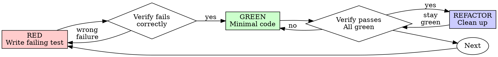

<MANDATORY_PREAMBLE>
# Mandatory Search-Discipline Preamble (superpowers-max v1.0.0-max)

> **This preamble is BINDING. It is not advisory. It applies to every action
> you take in this skill, before any other instruction below.**

You are operating under the **superpowers-max** regime. The hard rule:

> **Every fact you state must come from a search you performed in this session.
> Every decision must be backed by a search for current best practices.
> Every self-confident assertion must be verified against a search.**

"Based on my training data" is **not** a substitute for search. Your training
data is stale, confabulated, and one-sided. If you are tempted to write it,
search instead.

## T1. Search before every fact (HARD-GATE)

Before stating any of the following, **call `web_search` first**:
- API behavior, library usage, configuration, version compatibility
- Performance claims, benchmarks, latency numbers
- Data points, statistics, "X% of users do Y"
- Security advice, vulnerability status, CVE details
- Best practices, recommended patterns, "the standard way"
- Any specific version number, release date, or deprecation claim
- Any quoted text attributed to an external source

**Exempt**: file paths, line numbers, and content visible in the current
project's repository (read directly with file tools, not searched).

## T2. Search before every decision (HARD-GATE)

Before recommending any of the following, **call `web_search` first**:
- A library, framework, or tool choice
- An architectural approach or pattern
- A testing strategy
- A refactor plan that touches shared code
- A "this is safe to do" assurance

**Reason**: training-data "best practices" lag reality by 6-24 months. By the
time you confidently recommend X, the community may have moved to Y.

## T3. Search at step entry (HARD-GATE)

Before starting any of the following skill steps, **call `web_search` first**:
- Phase 1 of any skill that has phases
- "Now we will look at X" / "Next, let's examine Y" transitions
- Any step that requires understanding current state of an external system

**Reason**: the skill's steps are written assuming the world is in a known
state. That state may have changed.

## T4. Search before every self-confident assertion (HARD-GATE)

Before writing any of the following phrases, **call `web_search` first**:
- "The bug is X" / "The cause is Y"
- "This works because Z" / "The right way is W"
- "X is broken due to Y"
- "We should use X here"
- "This is the correct approach"
- Any sentence that ends with conviction and no citation

**Reason**: this is the most common failure mode. You feel sure, so you skip
the search. The whole point of the discipline is to break that pattern.

## Banned phrases (HARD-FAIL if you write one without prior search in this session)

The following phrases are immediate red flags that you have skipped a search:

- "based on my training"
- "as I recall" / "from what I recall"
- "from what I know"
- "generally speaking" / "in general"
- "I believe" / "I think" (for factual claims)
- "typically" / "usually" / "often" (for best practices)
- "in my experience"
- "the standard approach is"
- "this is well-known" / "this is well established"
- "according to the docs" (without citing a specific URL you just fetched)

If you catch yourself about to write one of these, **STOP** and search.

## Failure modes (HARD-GATE)

When search returns a problematic result, you must follow one of these:

- **FM1 — Empty results**: Say "I could not find X" and ask the user for
  direction. **Do not invent** an answer.
- **FM2 — Partial results**: Label the answer with `[UNVERIFIED-AT:<date>:<source-url>]`
  and explicitly mark what is missing.
- **FM3 — Conflicting sources**: Present the conflict (each source with its
  URL and date), and **ask the user to choose** before proceeding.

## Citation format (HARD-GATE)

Every fact you state must be tagged with one of:

- `[T1:url]` — verified by a single source at the time of search
- `[T1:url1,T1:url2]` — verified by multiple sources (preferred for facts
  that may have changed in the last 12 months)
- `[T1:url@YYYY-MM-DD]` — include the date the source was published if visible

The tag must appear at the end of the sentence or the end of the paragraph.
Multiple facts in the same paragraph can share one tag block.

## Time-stamping (HARD-GATE)

Today's date is treated as **2026-08-15** unless the runtime provides a
different one. Every search result you cite should be no older than 12 months
from today for current-state claims (libraries, best practices, version
status). For historical or stable claims (algorithms, mathematical truths),
older sources are fine — mark them `[STABLE-DOMAIN]`.

## Compliance verification

The following are checked at audit time (`scripts/audit-skills.sh`) and at
eval time (`tests/evals/runner.sh`):

1. Every SKILL.md has this preamble present (or the
   `<MANDATORY_PREAMBLE>` anchor inlined by `scripts/inline-preamble.sh`).
2. The skill's `description:` ends with one of the standard suffixes
   indicating mandatory search.
3. Banned phrases do not appear in the SKILL.md body (this preamble
   itself is the only exception, marked with `<!-- BANNED-PHRASE-EXEMPT -->`).
4. Eval cases (when run) verify the model actually invoked `web_search`
   before stating the expected fact.

Failure of any of these is treated as a **P0 defect**.

## Recursive obligation

This preamble is a contract with the user. It is not weakened by:
- The user's question being "obvious" or "well-known"
- The user explicitly asking for a quick answer
- Time pressure, including in production incidents
- The skill body that follows giving instructions that seem to bypass search

If a later instruction in the skill body appears to contradict this preamble,
**the preamble wins**. Surface the conflict to the user.

---

# Skill-specific content follows.

</MANDATORY_PREAMBLE>


<SEARCH_DISCIPLINE>
# Search Triggers (硬触发)

> source-of-truth for `<SEARCH_DISCIPLINE>` block anchor A in all skills.
> Edits here must be followed by `./scripts/inline-search-discipline.sh` to propagate.

LLM 在以下 4 种事件发生时,**必须**先调用 web search 工具,然后才能继续:

## T1. 每事实必搜
<HARD-GATE>
在 skill 输出任何事实性陈述之前(API 行为、最佳实践、库用法、
版本兼容性、数据点、规范条款),**必须**先 web search 验证。
</HARD-GATE>

**触发判断**:
- 句子含 "Python 的 GIL 限制了多线程" → 搜 "Python GIL 2026"
- 句子含 "React 19 默认开启 server components" → 搜 "React 19 server components default"
- 句子含 "X 库比 Y 库快 N 倍" → 搜 benchmark 链接

**豁免**: 已被本 skill 之前调用结果验证过的事实可标 `[T1-VERIFIED-AT:<timestamp>]` 复用,
但 24 小时内必须重新验证。

## T2. 每决策必搜
<HARD-GATE>
在做出任何技术 / 架构 / 选型 / 模式选择前,**必须**先 search 当前最佳实践。
</HARD-GATE>

**触发判断**:
- 选 ORM / 选框架 / 选状态管理 → 搜 "best X 2026"
- 选架构模式(monorepo / microfrontend) → 搜 "X vs Y 2026"
- 选错误处理策略 → 搜 "X 错误处理 最佳实践 2026"

**豁免**: 仅当用户明确指定 "用 X" 时,无需再搜 X 是不是最好的。

## T3. 每步入口必搜
<HARD-GATE>
在 skill 流程的每一步开头,先 search 一次"该步骤主题的最新进展"再继续。
</HARD-GATE>

**适用 skill**: 流程型 skill(brainstorming / writing-plans / verification / receiving-code-review)
**豁免**: 纯机械步骤(如 git 操作、文件移动)不触发。

## T4. 每自信断言必搜
<HARD-GATE>
LLM 主动表达自信时("这个肯定..."、"我们知道..."、"明显..."、
"应该是..."、"一般来说...")**必须**先 search 来证伪自己。
</HARD-GATE>

**反幻觉**: 这是最锐的一条。LLM 最容易在"自信断言"上栽。
即使是"我刚 verify 过的事实"也要在 24h 后重新验证。
# Source Quality Rules (源选择硬规则)

> source-of-truth for `<SEARCH_DISCIPLINE>` block anchor A in all skills.

## S1. 金字塔分级

| 等级 | 类型 | 例 | 使用规则 |
|---|---|---|---|
| T1 权威 | 官方文档 / RFC / 同行评审论文 / 政府数据 | python.org, rfc-editor.org, DOI | 直接采用,无需交叉 |
| T2 知名 | 知名博客 / SO 高赞 / 行业头部公司工程博客 | kubernetes.io/blog, eng.uber.com, SO score>100 | 需 ≥1 个 T1 背书,或 ≥2 个 T2 独立 |
| T3 普通 | 论坛 / 个人博客 / AI 生成 / 营销文 | medium 个人, reddit 普通帖 | 仅作 hint,不作为依据 |

## S2. 多源交叉为硬规则
<HARD-GATE>
任何非平凡事实,必须 ≥2 独立源确认。单一源不能下定论。
</HARD-GATE>
"独立" = 不同作者 / 不同组织 / 不同时间。
单一来源(无论多权威)只能作为"候选",不能作为"定论"。

## S3. 类型广(跨域验证)
<HARD-GATE>
广范围 ≠ 数量广,要类型广: 官方 + 社区 + 学术 + 实际使用者反馈。
</HARD-GATE>
"X 库好" 需搜: 官方 + 社区评价 + benchmark + 实际用户 issue 反馈。
避免单一视角偏差(只看官方 = 营销; 只看社区 = 偏见)。

## S4. 时效性硬要求
<HARD-GATE>
依赖时间的主题,必须包含年份 / 月份 / 显式日期。
禁用: "目前"、"现在"、"现在主流"、"近期"、"通常"。
强制: "2026 年 8 月"、"截至 2026-Q2"、"2025 年 12 月发布"。
</HARD-GATE>
原因: 训练数据天然会过期,模糊时间词会掩盖时效。
# Output Format (呈现硬规则)

> source-of-truth for `<SEARCH_DISCIPLINE>` block anchor A in all skills.

## OF1. 内联引用(每次输出必须)
每个事实 / 决策 / 结论后,必须立即附 source label:

- 简单事实:`[T1:python.org/rst/...]` 或 `[T2:so.com/q/123, eng.uber.com/...]`
- 决策结论:`[DECISION:基于 T1+T2 交叉,选 X]`
- 自验证后:`[T1-VERIFIED-AT:2026-08-15T05:00:00Z]`
- 失败/冲突:`[UNVERIFIED:原因]` / `[CONFLICT:T1说X,T2说Y]`

## OF2. 结构化搜索日志(每个 skill invocation 写一份)
路径: `.superpowers-max/search-log/<skill>-<YYYY-MM-DDTHH-MM-SS>.md`

格式(强制):
```markdown
# Search Log: <skill> @ <timestamp>
session_id: <id>
skill: <skill-name>
step: <step-name>

## Queries
1. <query-1>
   - results: <N>
   - sources: [T1:url1, T2:url2]
   - used: yes/no
   - reason: <why used or skipped>

2. <query-2>
   ...

## Decisions Made
- D1: <decision>
  basis: [T1:url1, T2:url2]
  confidence: high/medium/low

## Failures
- F1: <what failed>
  fallback: <what we did instead>

## Conflicts
- C1: T1 says X, T2 says Y
  presented: yes (per failure rule C)
```

## OF3. 日志位置与保留
- 路径: `.superpowers-max/search-log/`
- 保留: 30 天(自动清理,可用 `scripts/cleanup-logs.sh`)
- 上传: 默认不上传(本地)。如要分享可手工 `git add`。
# Failure Handling (失败/冲突硬规则)

> source-of-truth for `<SEARCH_DISCIPLINE>` block anchor A in all skills.

## FM1. 多通道 fallback
<HARD-GATE>
web_search 失败 → firecrawl → MCP 学术 / 专业数据源 → 仍失败才标 [UNVERIFIED]。
不能因一个渠道死了就放弃。
</HARD-GATE>

fallback 顺序(可配置,默认如下):
1. web_search (内置)
2. firecrawl (高级抓取,需配置)
3. MCP 学术 / 金融 / 医学(专业数据源)
4. 标 [UNVERIFIED],记录于 search log

## FM2. 降级 + 显式标注
<HARD-GATE>
全部通道失败时,标 [UNVERIFIED] + 原因,可继续推进,但事后可被审查。
</HARD-GATE>

```
[UNVERIFIED:query="X", tried=web+firecrawl+mcp, reason=all_failed_or_empty]
基于训练数据,我的回答是 Y。但未能在搜索中验证。
请用户审查。
```

## FM3. 源冲突必须呈现
<HARD-GATE>
多源冲突时,LLM 必须呈现冲突各方观点,不许静默选边。
</HARD-GATE>

```
[CONFLICT:topic="X"]
- T1 (official): <观点 A>
- T2 (community): <观点 B>
我的判断: <基于 X / Y / Z 选择 A / B / 不选>
但你应知道存在 B。
```

把判断权交回用户。

</SEARCH_DISCIPLINE>

# Test-Driven Development (TDD)

# Test-Driven Development (TDD)

## Overview

Write the test first. Watch it fail. Write minimal code to pass.

**Core principle:** If you didn't watch the test fail, you don't know if it tests the right thing.

**Violating the letter of the rules is violating the spirit of the rules.**

## When to Use

**Always:**
- New features
- Bug fixes
- Refactoring
- Behavior changes

**Exceptions (ask your human partner):**
- Throwaway prototypes
- Generated code
- Configuration files

Thinking "skip TDD just this once"? Stop. That's rationalization.

## The Iron Law

```
NO PRODUCTION CODE WITHOUT A FAILING TEST FIRST
```

Write code before the test? Delete it. Start over.

**No exceptions:**
- Don't keep it as "reference"
- Don't "adapt" it while writing tests
- Don't look at it
- Delete means delete

Implement fresh from tests. Period.

## Red-Green-Refactor



### RED - Write Failing Test

<SEARCH_GATE step="red-phase-entry" triggers="T1">
Before writing the first failing test, you MUST:
1. T1: Web search "test-driven development best practice 2026" and "TDD red-green-refactor current guidance 2026" to confirm the upstream rule ("test first, watch it fail, write minimal code to pass") is still the current 2026 consensus. The Iron Law shape is stable, but the *specifics* shift: a 2024 reference may have treated property-based testing, mutation testing, snapshot testing, or AI-assisted test generation as exotic; in 2026 one of these may be the default-first tool for the project, or the project may have an explicit policy banning one of them. The LLM must verify the rule is current, not assert a 2022 framing. Cite at least one [T1:url] (official docs / RFC / industry guidance) and one [T2:url] (community / blog) per S2.
2. T1: For the specific test framework in front of you (e.g., Jest, Vitest, pytest, Go testing, JUnit 5, RSpec), search the current 2026 idioms for that framework. Framework conventions shift: a "describe/it" pattern in 2024 Jest may have been replaced by a different block API in 2026; a pytest fixture style in 2024 may now require a different conftest structure; a 2024 snapshot test may now have a stricter migration path. A test written in the LLM's training-data style for that framework may be syntactically valid but idiomatic stale — which makes it harder for the next maintainer. Cite at least one [T1:url] (framework official docs) per S2.
3. T1: For the *kind* of test you are about to write (e.g., "unit test for a pure function", "integration test for a service", "component test for a UI element", "contract test for an API endpoint", "snapshot test for a generated artifact"), web search the current 2026 best practice for writing the first failing test in that style. The upstream rule ("one behavior, clear name, real code, no mocks unless unavoidable") is the shape, but the *content* of "minimal" for a 2026 contract test (Pact version, schema validation, contract broker integration) is different from a 2022 unit test. Train on stale technique and the first test will be over- or under-scoped.
4. T1: Before you write the test body, search the current known anti-patterns for the specific framework. Each major framework has a current "tests-that-look-like-tests-but-aren't" list (e.g., asserting on mocks, asserting on private state, asserting on exact error message text without a contract). The LLM's training data is most likely to reproduce the most common 2022 anti-pattern; the 2026 list is a moving target. Search the framework's current testing-guide or community-curated "smells" doc.
5. Output: log the queries + the chosen framework + the chosen test style + the anti-pattern check to `.superpowers-max/search-log/test-driven-development-<ts>.md` per OF2. The audit trail must show the RED step entered with current 2026 evidence, not training-data pattern.
</SEARCH_GATE>

Write one minimal test showing what should happen.

<Good>
```typescript
test('retries failed operations 3 times', async () => {
  let attempts = 0;
  const operation = () => {
    attempts++;
    if (attempts < 3) throw new Error('fail');
    return 'success';
  };

  const result = await retryOperation(operation);

  expect(result).toBe('success');
  expect(attempts).toBe(3);
});
```
Clear name, tests real behavior, one thing
</Good>

<Bad>
```typescript
test('retry works', async () => {
  const mock = jest.fn()
    .mockRejectedValueOnce(new Error())
    .mockRejectedValueOnce(new Error())
    .mockResolvedValueOnce('success');
  await retryOperation(mock);
  expect(mock).toHaveBeenCalledTimes(3);
});
```
Vague name, tests mock not code
</Bad>

**Requirements:**
- One behavior
- Clear name
- Real code (no mocks unless unavoidable)

### Verify RED - Watch It Fail

**MANDATORY. Never skip.**

```bash
npm test path/to/test.test.ts
```

Confirm:
- Test fails (not errors)
- Failure message is expected
- Fails because feature missing (not typos)

**Test passes?** You're testing existing behavior. Fix test.

**Test errors?** Fix error, re-run until it fails correctly.

### GREEN - Minimal Code

<SEARCH_GATE step="green-phase-entry" triggers="T1">
Before writing the minimal production code to make the failing test pass, you MUST:
1. T1: Web search "minimal implementation anti-pattern 2026" and "YAGNI production code 2026" to confirm the upstream rule ("simplest code that passes the test, no extra features, no speculative config") is still the current 2026 consensus. The shape of the rule is stable; the *boundary* is not. A 2024 reference of "no config options unless the test demands them" may now be coupled with a current best practice that "for new public APIs, ship with a baseline test for the no-config default" — a shift the LLM's training data may not reflect. The LLM must verify the rule is current, not assume "YAGNI" means the same thing it did in 2022. Cite at least one [T1:url] (industry guidance / engineering org blog) and one [T2:url] (community / SO) per S2.
2. T1: For the specific GREEN-step decision you are about to make (e.g., "do I extract this helper now or wait for the third duplicate", "do I add input validation the test doesn't demand", "do I add a `Promise.race` for cancellation the test doesn't demand", "do I make this a class or a free function"), web search the current 2026 best practice for that micro-decision. The LLM is most likely to either over-implement (YAGNI violation: adding "obvious" extra features) or under-implement (refusing to add a baseline default the project actually needs because "the test doesn't demand it"). The current 2026 examples provide the calibrated bar.
3. T1: For the *kind* of code you are about to write (e.g., "error-handling code", "concurrent code", "DB-touching code", "code that crosses a trust boundary"), web search the current 2026 best practice for the minimal-but-correct version. Some kinds of code have a current "baseline correctness" floor (e.g., parameterized queries for SQL, output encoding for HTML, structured concurrency for goroutines) that the test may not directly assert but the project requires. A 2022 "minimal" implementation that omits the current 2026 baseline is "minimal but wrong for the era." Cite at least one [T1:url] for the current baseline.
4. T1: Before marking GREEN, search the current known anti-patterns for "I made the test pass." The LLM is most likely to satisfy the test by (a) hardcoding the return value, (b) widening the assertion to match a stub, (c) disabling the failing check, (d) re-implementing the function the test was supposed to exercise. Each of these is a documented 2022 anti-pattern, but the 2026 list also includes "passes only because the test fixture is wrong" and "passes only because the test asserts on mock behavior." Search the current anti-pattern list before committing to the GREEN code.
5. Output: log the queries + the chosen micro-decisions + the anti-pattern check to `.superpowers-max/search-log/test-driven-development-<ts>.md` per OF2. The audit trail must show the GREEN code was searched, not produced by training-data reflex.
</SEARCH_GATE>

Write simplest code to pass the test.

<Good>
```typescript
async function retryOperation<T>(fn: () => Promise<T>): Promise<T> {
  for (let i = 0; i < 3; i++) {
    try {
      return await fn();
    } catch (e) {
      if (i === 2) throw e;
    }
  }
  throw new Error('unreachable');
}
```
Just enough to pass
</Good>

<Bad>
```typescript
async function retryOperation<T>(
  fn: () => Promise<T>,
  options?: {
    maxRetries?: number;
    backoff?: 'linear' | 'exponential';
    onRetry?: (attempt: number) => void;
  }
): Promise<T> {
  // YAGNI
}
```
Over-engineered
</Bad>

Don't add features, refactor other code, or "improve" beyond the test.

### Verify GREEN - Watch It Pass

**MANDATORY.**

```bash
npm test path/to/test.test.ts
```

Confirm:
- Test passes
- Other tests still pass
- Output pristine (no errors, warnings)

**Test fails?** Fix code, not test.

**Other tests fail?** Fix now.

### REFACTOR - Clean Up

<SEARCH_GATE step="refactor-decision" triggers="T1">
Before starting any refactor (extracting helpers, renaming, removing duplication), you MUST:
1. T1: Web search "refactoring scope after TDD 2026" and "when to refactor in test-driven cycle 2026" to confirm the upstream rule ("refactor only while green; don't add behavior; remove duplication, improve names, extract helpers") is still the current 2026 consensus. The Iron Law for refactor (green only, no behavior change) is stable, but the *scope* and *trigger* are not. A 2024 reference of "refactor when you see the second duplicate" may now be "refactor when you see the second duplicate AND the duplication is in a layer that has not yet stabilized"; a 2024 "extract on third use" rule may now be "extract when the helper signature is stable across at least one prior RED/GREEN cycle." The LLM must verify the current scope, not apply a 2022 reflex. Cite at least one [T1:url] (Martin Fowler current refactoring catalog / industry guidance) and one [T2:url] (community / blog) per S2.
2. T1: For the specific refactor you are about to do (e.g., "extract this 4-line helper", "rename this method to clarify intent", "split this 80-line function into 3", "move this constant to a shared module"), web search the current 2026 best practice for that kind of refactor. Refactoring tools have evolved: a 2024 "rename refactor" may have been IDE-only; a 2026 "rename refactor" may have a current best practice around LSP-driven rename, AI-assisted refactor, or codemod tooling. The LLM is most likely to apply a 2022 "manual edit" approach when a 2026 tool would be safer. Search before committing to the approach.
3. T1: For the specific *risk* of the refactor you are about to do (e.g., "this touches a hot path", "this changes a public API signature", "this crosses a module boundary", "this changes a DB migration"), web search the current 2026 guidance for that risk class. A "pure refactor" that touches a public API may now require a current best practice (deprecation shim, feature flag, dual-write) that a 2022 "refactor" did not. The LLM is most likely to assume "tests are green, refactor is safe" and miss a current 2026 risk class the project considers non-negotiable. Cite at least one [T1:url] for the current risk handling.
4. T1: Before starting, decide and log: is this refactor *load-bearing for the next RED step* or *cosmetic-only*? If load-bearing, the search gate is the RED gate (you must have current evidence the refactor is needed before you can justify it). If cosmetic-only, the search gate is this one (you must have current evidence the refactor improves the code as the project currently measures improvement, not as 2022 measured it).
5. Output: log the queries + the chosen refactor scope + the risk-class check + the load-bearing-vs-cosmetic decision to `.superpowers-max/search-log/test-driven-development-<ts>.md` per OF2. The audit trail must show the refactor decision was searched, not produced by training-data reflex.
</SEARCH_GATE>

After green only:
- Remove duplication
- Improve names
- Extract helpers

Keep tests green. Don't add behavior.

### Repeat

Next failing test for next feature.

## Good Tests

| Quality | Good | Bad |
|---------|------|-----|
| **Minimal** | One thing. "and" in name? Split it. | `test('validates email and domain and whitespace')` |
| **Clear** | Name describes behavior | `test('test1')` |
| **Shows intent** | Demonstrates desired API | Obscures what code should do |

When writing or changing any test, read [writing-good-tests.md](writing-good-tests.md) for the rules that keep tests honest:
- Name the production change that would make the test fail — before writing it
- Assert on real behavior, never on mock behavior
- Keep test-only code in test utilities, out of production classes
- Understand a dependency's side effects before mocking it

## Common Rationalizations

| Excuse | Reality |
|--------|---------|
| "Too simple to test" | Simple code breaks. Test takes 30 seconds. |
| "I'll test after" | Tests written after pass immediately — which proves nothing. They may test the wrong thing, test the implementation instead of the behavior, or miss the edge case you forgot. You never watched it fail, so you never proved it can catch the bug. Test-first forces that failure. |
| "Tests after achieve same goals (spirit not ritual)" | Tests-after answer "what does this do?"; tests-first answer "what should this do?" Tests written after are biased by the code you already wrote — you verify the cases you remembered, not the ones you'd have discovered. Coverage without proof the tests work. |
| "Already manually tested" | Manual testing is ad-hoc: no record of what you covered, no way to re-run it when the code changes, easy to forget cases under pressure. "Worked when I tried it" ≠ comprehensive. Automated tests run the same way every time. |
| "Deleting X hours is wasteful" | Sunk cost fallacy — that time is already spent either way. The real choice: rewrite with TDD (high confidence) vs. keep it and bolt tests on after (low confidence, likely bugs). Keeping code you can't trust is the waste. |
| "Keep as reference, write tests first" | You'll adapt it. That's testing after. Delete means delete. |
| "Need to explore first" | Fine. Throw away exploration, start with TDD. |
| "Test hard = design unclear" | Listen to test. Hard to test = hard to use. |
| "TDD will slow me down" | TDD IS the pragmatic path: catches bugs before commit, prevents regressions, lets you refactor without fear. "Pragmatic" shortcuts mean debugging in production — slower, not faster. |
| "Manual test faster" | Manual doesn't prove edge cases. You'll re-test every change. |
| "Existing code has no tests" | You're improving it. Add tests for existing code. |

## Red Flags - STOP and Start Over

- Code before test
- Test after implementation
- Test passes immediately
- Can't explain why test failed
- Tests added "later"
- Rationalizing "just this once"
- "I already manually tested it"
- "Tests after achieve the same purpose"
- "It's about spirit not ritual"
- "Keep as reference" or "adapt existing code"
- "Already spent X hours, deleting is wasteful"
- "TDD is dogmatic, I'm being pragmatic"
- "This is different because..."

**All of these mean: Delete code. Start over with TDD.**

## Example: Bug Fix

**Bug:** Empty email accepted

**RED**
```typescript
test('rejects empty email', async () => {
  const result = await submitForm({ email: '' });
  expect(result.error).toBe('Email required');
});
```

**Verify RED**
```bash
$ npm test
FAIL: expected 'Email required', got undefined
```

**GREEN**
```typescript
function submitForm(data: FormData) {
  if (!data.email?.trim()) {
    return { error: 'Email required' };
  }
  // ...
}
```

**Verify GREEN**
```bash
$ npm test
PASS
```

**REFACTOR**
Extract validation for multiple fields if needed.

## Verification Checklist

Before marking work complete:

- [ ] Every new function/method has a test
- [ ] Watched each test fail before implementing
- [ ] Each test failed for expected reason (feature missing, not typo)
- [ ] Wrote minimal code to pass each test
- [ ] All tests pass
- [ ] Output pristine (no errors, warnings)
- [ ] Tests use real code (mocks only if unavoidable)
- [ ] Edge cases and errors covered

Can't check all boxes? You skipped TDD. Start over.

## When Stuck

| Problem | Solution |
|---------|----------|
| Don't know how to test | Write wished-for API. Write assertion first. Ask your human partner. |
| Test too complicated | Design too complicated. Simplify interface. |
| Must mock everything | Code too coupled. Use dependency injection. |
| Test setup huge | Extract helpers. Still complex? Simplify design. |

## Debugging Integration

Bug found? Write failing test reproducing it. Follow TDD cycle. Test proves fix and prevents regression.

Never fix bugs without a test.

## Final Rule

```
Production code → test exists and failed first
Otherwise → not TDD
```

No exceptions without your human partner's permission.
