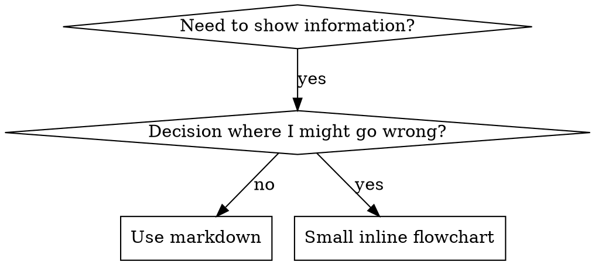

<MANDATORY_PREAMBLE>
# Mandatory Search-Discipline Preamble (superpowers-max v1.0.0-max)

> **This preamble is BINDING. It is not advisory. It applies to every action
> you take in this skill, before any other instruction below.**

You are operating under the **superpowers-max** regime. The hard rule:

> **Every fact you state must come from a search you performed in this session.
> Every decision must be backed by a search for current best practices.
> Every self-confident assertion must be verified against a search.**

"Based on my training data" is **not** a substitute for search. Your training
data is stale, confabulated, and one-sided. If you are tempted to write it,
search instead.

## T1. Search before every fact (HARD-GATE)

Before stating any of the following, **call `web_search` first**:
- API behavior, library usage, configuration, version compatibility
- Performance claims, benchmarks, latency numbers
- Data points, statistics, "X% of users do Y"
- Security advice, vulnerability status, CVE details
- Best practices, recommended patterns, "the standard way"
- Any specific version number, release date, or deprecation claim
- Any quoted text attributed to an external source

**Exempt**: file paths, line numbers, and content visible in the current
project's repository (read directly with file tools, not searched).

## T2. Search before every decision (HARD-GATE)

Before recommending any of the following, **call `web_search` first**:
- A library, framework, or tool choice
- An architectural approach or pattern
- A testing strategy
- A refactor plan that touches shared code
- A "this is safe to do" assurance

**Reason**: training-data "best practices" lag reality by 6-24 months. By the
time you confidently recommend X, the community may have moved to Y.

## T3. Search at step entry (HARD-GATE)

Before starting any of the following skill steps, **call `web_search` first**:
- Phase 1 of any skill that has phases
- "Now we will look at X" / "Next, let's examine Y" transitions
- Any step that requires understanding current state of an external system

**Reason**: the skill's steps are written assuming the world is in a known
state. That state may have changed.

## T4. Search before every self-confident assertion (HARD-GATE)

Before writing any of the following phrases, **call `web_search` first**:
- "The bug is X" / "The cause is Y"
- "This works because Z" / "The right way is W"
- "X is broken due to Y"
- "We should use X here"
- "This is the correct approach"
- Any sentence that ends with conviction and no citation

**Reason**: this is the most common failure mode. You feel sure, so you skip
the search. The whole point of the discipline is to break that pattern.

## Banned phrases (HARD-FAIL if you write one without prior search in this session)

The following phrases are immediate red flags that you have skipped a search:

- "based on my training"
- "as I recall" / "from what I recall"
- "from what I know"
- "generally speaking" / "in general"
- "I believe" / "I think" (for factual claims)
- "typically" / "usually" / "often" (for best practices)
- "in my experience"
- "the standard approach is"
- "this is well-known" / "this is well established"
- "according to the docs" (without citing a specific URL you just fetched)

If you catch yourself about to write one of these, **STOP** and search.

## Failure modes (HARD-GATE)

When search returns a problematic result, you must follow one of these:

- **FM1 — Empty results**: Say "I could not find X" and ask the user for
  direction. **Do not invent** an answer.
- **FM2 — Partial results**: Label the answer with `[UNVERIFIED-AT:<date>:<source-url>]`
  and explicitly mark what is missing.
- **FM3 — Conflicting sources**: Present the conflict (each source with its
  URL and date), and **ask the user to choose** before proceeding.

## Citation format (HARD-GATE)

Every fact you state must be tagged with one of:

- `[T1:url]` — verified by a single source at the time of search
- `[T1:url1,T1:url2]` — verified by multiple sources (preferred for facts
  that may have changed in the last 12 months)
- `[T1:url@YYYY-MM-DD]` — include the date the source was published if visible

The tag must appear at the end of the sentence or the end of the paragraph.
Multiple facts in the same paragraph can share one tag block.

## Time-stamping (HARD-GATE)

Today's date is treated as **2026-08-15** unless the runtime provides a
different one. Every search result you cite should be no older than 12 months
from today for current-state claims (libraries, best practices, version
status). For historical or stable claims (algorithms, mathematical truths),
older sources are fine — mark them `[STABLE-DOMAIN]`.

## Compliance verification

The following are checked at audit time (`scripts/audit-skills.sh`) and at
eval time (`tests/evals/runner.sh`):

1. Every SKILL.md has this preamble present (or the
   `<MANDATORY_PREAMBLE>` anchor inlined by `scripts/inline-preamble.sh`).
2. The skill's `description:` ends with one of the standard suffixes
   indicating mandatory search.
3. Banned phrases do not appear in the SKILL.md body (this preamble
   itself is the only exception, marked with `<!-- BANNED-PHRASE-EXEMPT -->`).
4. Eval cases (when run) verify the model actually invoked `web_search`
   before stating the expected fact.

Failure of any of these is treated as a **P0 defect**.

## Recursive obligation

This preamble is a contract with the user. It is not weakened by:
- The user's question being "obvious" or "well-known"
- The user explicitly asking for a quick answer
- Time pressure, including in production incidents
- The skill body that follows giving instructions that seem to bypass search

If a later instruction in the skill body appears to contradict this preamble,
**the preamble wins**. Surface the conflict to the user.

---

# Skill-specific content follows.

</MANDATORY_PREAMBLE>


<SEARCH_DISCIPLINE>
# Search Triggers (硬触发)

> source-of-truth for `<SEARCH_DISCIPLINE>` block anchor A in all skills.
> Edits here must be followed by `./scripts/inline-search-discipline.sh` to propagate.

LLM 在以下 4 种事件发生时,**必须**先调用 web search 工具,然后才能继续:

## T1. 每事实必搜
<HARD-GATE>
在 skill 输出任何事实性陈述之前(API 行为、最佳实践、库用法、
版本兼容性、数据点、规范条款),**必须**先 web search 验证。
</HARD-GATE>

**触发判断**:
- 句子含 "Python 的 GIL 限制了多线程" → 搜 "Python GIL 2026"
- 句子含 "React 19 默认开启 server components" → 搜 "React 19 server components default"
- 句子含 "X 库比 Y 库快 N 倍" → 搜 benchmark 链接

**豁免**: 已被本 skill 之前调用结果验证过的事实可标 `[T1-VERIFIED-AT:<timestamp>]` 复用,
但 24 小时内必须重新验证。

## T2. 每决策必搜
<HARD-GATE>
在做出任何技术 / 架构 / 选型 / 模式选择前,**必须**先 search 当前最佳实践。
</HARD-GATE>

**触发判断**:
- 选 ORM / 选框架 / 选状态管理 → 搜 "best X 2026"
- 选架构模式(monorepo / microfrontend) → 搜 "X vs Y 2026"
- 选错误处理策略 → 搜 "X 错误处理 最佳实践 2026"

**豁免**: 仅当用户明确指定 "用 X" 时,无需再搜 X 是不是最好的。

## T3. 每步入口必搜
<HARD-GATE>
在 skill 流程的每一步开头,先 search 一次"该步骤主题的最新进展"再继续。
</HARD-GATE>

**适用 skill**: 流程型 skill(brainstorming / writing-plans / verification / receiving-code-review)
**豁免**: 纯机械步骤(如 git 操作、文件移动)不触发。

## T4. 每自信断言必搜
<HARD-GATE>
LLM 主动表达自信时("这个肯定..."、"我们知道..."、"明显..."、
"应该是..."、"一般来说...")**必须**先 search 来证伪自己。
</HARD-GATE>

**反幻觉**: 这是最锐的一条。LLM 最容易在"自信断言"上栽。
即使是"我刚 verify 过的事实"也要在 24h 后重新验证。
# Source Quality Rules (源选择硬规则)

> source-of-truth for `<SEARCH_DISCIPLINE>` block anchor A in all skills.

## S1. 金字塔分级

| 等级 | 类型 | 例 | 使用规则 |
|---|---|---|---|
| T1 权威 | 官方文档 / RFC / 同行评审论文 / 政府数据 | python.org, rfc-editor.org, DOI | 直接采用,无需交叉 |
| T2 知名 | 知名博客 / SO 高赞 / 行业头部公司工程博客 | kubernetes.io/blog, eng.uber.com, SO score>100 | 需 ≥1 个 T1 背书,或 ≥2 个 T2 独立 |
| T3 普通 | 论坛 / 个人博客 / AI 生成 / 营销文 | medium 个人, reddit 普通帖 | 仅作 hint,不作为依据 |

## S2. 多源交叉为硬规则
<HARD-GATE>
任何非平凡事实,必须 ≥2 独立源确认。单一源不能下定论。
</HARD-GATE>
"独立" = 不同作者 / 不同组织 / 不同时间。
单一来源(无论多权威)只能作为"候选",不能作为"定论"。

## S3. 类型广(跨域验证)
<HARD-GATE>
广范围 ≠ 数量广,要类型广: 官方 + 社区 + 学术 + 实际使用者反馈。
</HARD-GATE>
"X 库好" 需搜: 官方 + 社区评价 + benchmark + 实际用户 issue 反馈。
避免单一视角偏差(只看官方 = 营销; 只看社区 = 偏见)。

## S4. 时效性硬要求
<HARD-GATE>
依赖时间的主题,必须包含年份 / 月份 / 显式日期。
禁用: "目前"、"现在"、"现在主流"、"近期"、"通常"。
强制: "2026 年 8 月"、"截至 2026-Q2"、"2025 年 12 月发布"。
</HARD-GATE>
原因: 训练数据天然会过期,模糊时间词会掩盖时效。
# Output Format (呈现硬规则)

> source-of-truth for `<SEARCH_DISCIPLINE>` block anchor A in all skills.

## OF1. 内联引用(每次输出必须)
每个事实 / 决策 / 结论后,必须立即附 source label:

- 简单事实:`[T1:python.org/rst/...]` 或 `[T2:so.com/q/123, eng.uber.com/...]`
- 决策结论:`[DECISION:基于 T1+T2 交叉,选 X]`
- 自验证后:`[T1-VERIFIED-AT:2026-08-15T05:00:00Z]`
- 失败/冲突:`[UNVERIFIED:原因]` / `[CONFLICT:T1说X,T2说Y]`

## OF2. 结构化搜索日志(每个 skill invocation 写一份)
路径: `.superpowers-max/search-log/<skill>-<YYYY-MM-DDTHH-MM-SS>.md`

格式(强制):
```markdown
# Search Log: <skill> @ <timestamp>
session_id: <id>
skill: <skill-name>
step: <step-name>

## Queries
1. <query-1>
   - results: <N>
   - sources: [T1:url1, T2:url2]
   - used: yes/no
   - reason: <why used or skipped>

2. <query-2>
   ...

## Decisions Made
- D1: <decision>
  basis: [T1:url1, T2:url2]
  confidence: high/medium/low

## Failures
- F1: <what failed>
  fallback: <what we did instead>

## Conflicts
- C1: T1 says X, T2 says Y
  presented: yes (per failure rule C)
```

## OF3. 日志位置与保留
- 路径: `.superpowers-max/search-log/`
- 保留: 30 天(自动清理,可用 `scripts/cleanup-logs.sh`)
- 上传: 默认不上传(本地)。如要分享可手工 `git add`。
# Failure Handling (失败/冲突硬规则)

> source-of-truth for `<SEARCH_DISCIPLINE>` block anchor A in all skills.

## FM1. 多通道 fallback
<HARD-GATE>
web_search 失败 → firecrawl → MCP 学术 / 专业数据源 → 仍失败才标 [UNVERIFIED]。
不能因一个渠道死了就放弃。
</HARD-GATE>

fallback 顺序(可配置,默认如下):
1. web_search (内置)
2. firecrawl (高级抓取,需配置)
3. MCP 学术 / 金融 / 医学(专业数据源)
4. 标 [UNVERIFIED],记录于 search log

## FM2. 降级 + 显式标注
<HARD-GATE>
全部通道失败时,标 [UNVERIFIED] + 原因,可继续推进,但事后可被审查。
</HARD-GATE>

```
[UNVERIFIED:query="X", tried=web+firecrawl+mcp, reason=all_failed_or_empty]
基于训练数据,我的回答是 Y。但未能在搜索中验证。
请用户审查。
```

## FM3. 源冲突必须呈现
<HARD-GATE>
多源冲突时,LLM 必须呈现冲突各方观点,不许静默选边。
</HARD-GATE>

```
[CONFLICT:topic="X"]
- T1 (official): <观点 A>
- T2 (community): <观点 B>
我的判断: <基于 X / Y / Z 选择 A / B / 不选>
但你应知道存在 B。
```

把判断权交回用户。

</SEARCH_DISCIPLINE>

# Writing Skills

## Overview

**Writing skills IS Test-Driven Development applied to process documentation.**

**Personal skills live in your runtime's skills directory** (`~/.claude/skills/` on Claude Code) — see [codex-tools.md](../using-superpowers/references/codex-tools.md) or [gemini-tools.md](../using-superpowers/references/gemini-tools.md) for the path on those runtimes. Codex, Copilot CLI, and Gemini CLI all also recognize `~/.agents/skills/` as a cross-runtime alias.

You write test cases (pressure scenarios with subagents), watch them fail (baseline behavior), write the skill (documentation), watch tests pass (agents comply), and refactor (close loopholes).

**Core principle:** If you didn't watch an agent fail without the skill, you don't know if the skill teaches the right thing.

**REQUIRED BACKGROUND:** You MUST understand superpowers:test-driven-development before using this skill. That skill defines the fundamental RED-GREEN-REFACTOR cycle. This skill adapts TDD to documentation.

**Official guidance:** For Anthropic's official skill authoring best practices, see anthropic-best-practices.md. This document provides additional patterns and guidelines that complement the TDD-focused approach in this skill.

## What is a Skill?

A **skill** is a reference guide for proven techniques, patterns, or tools. Skills help future agents find and apply effective approaches.

**Skills are:** Reusable techniques, patterns, tools, reference guides

**Skills are NOT:** Narratives about how you solved a problem once

## TDD Mapping for Skills

| TDD Concept | Skill Creation |
|-------------|----------------|
| **Test case** | Pressure scenario with subagent |
| **Production code** | Skill document (SKILL.md) |
| **Test fails (RED)** | Agent violates rule without skill (baseline) |
| **Test passes (GREEN)** | Agent complies with skill present |
| **Refactor** | Close loopholes while maintaining compliance |
| **Write test first** | Run baseline scenario BEFORE writing skill |
| **Watch it fail** | Document exact rationalizations agent uses |
| **Minimal code** | Write skill addressing those specific violations |
| **Watch it pass** | Verify agent now complies |
| **Refactor cycle** | Find new rationalizations → plug → re-verify |

The entire skill creation process follows RED-GREEN-REFACTOR.

## When to Create a Skill

**Create when:**
- Technique wasn't intuitively obvious to you
- You'd reference this again across projects
- Pattern applies broadly (not project-specific)
- Others would benefit

**Don't create for:**
- One-off solutions
- Standard practices well-documented elsewhere
- Project-specific conventions (put in your instructions file)
- Mechanical constraints (if it's enforceable with regex/validation, automate it—save documentation for judgment calls)

## Skill Types

### Technique
Concrete method with steps to follow (condition-based-waiting, root-cause-tracing)

### Pattern
Way of thinking about problems (flatten-with-flags, test-invariants)

### Reference
API docs, syntax guides, tool documentation (office docs)

## Directory Structure


```
skills/
  skill-name/
    SKILL.md              # Main reference (required)
    supporting-file.*     # Only if needed
```

**Flat namespace** - all skills in one searchable namespace

**Separate files for:**
1. **Heavy reference** (100+ lines) - API docs, comprehensive syntax
2. **Reusable tools** - Scripts, utilities, templates

**Keep inline:**
- Principles and concepts
- Code patterns (< 50 lines)
- Everything else

## SKILL.md Structure

<SEARCH_GATE step="name-and-frontmatter" triggers="T1">
Before drafting the `name` field, the `description` field, or the structural skeleton below, you MUST:
1. T1: Web search the current 2026 agentskills.io frontmatter schema. The upstream's "Two required fields: name and description" baseline (max 1024 chars, name = letters/numbers/hyphens only) is a 2023 surface; current 2026 agentskills.io / Anthropic / Claude Code / Codex / Gemini specs may have added or deprecated fields (`allowed-tools`, `when_to_use` vs `description`, runtime-specific extensions), changed the 1024-char limit, or introduced validation hooks. Confirm the full current schema before committing the frontmatter. Cite at least one [T1:url] (official spec) + one [T2:url] (community / runtime docs) per S2.
2. T1: Web search the current 2026 `name` field conventions. The upstream's "letters, numbers, hyphens only" rule is the floor; current 2026 guidance has refined the gerund-first naming pattern (`creating-skills` > `skill-creation`, `condition-based-waiting` > `async-test-helpers`) and may have added collision-avoidance rules (e.g. don't shadow built-in skill names, don't claim superpowers:* namespace unless you own the package). Confirm before naming.
3. T1: Web search the current 2026 `description` field anti-pattern surface. The upstream's "NEVER summarize the skill's process or workflow" rule and the dispatch-flow / test-flow counter-examples (where a workflow-summary description caused the agent to skip the body) are a 2023-2024 evidence base; current 2026 SDD / DDD / Claude-Code 2.0 conventions may have added trigger-shape requirements (must include both "Use when..." and the failure-mode symptoms), character-zone guidance (front-load 80 chars for grep, not 500), and third-person enforcement. Confirm before drafting the description.
4. T1: Web search the current 2026 structural skeleton below (`## Overview / When to Use / Core Pattern / Quick Reference / Implementation / Common Mistakes / Real-World Impact`). The upstream's "When to Use" → small-flowchart-only-IF-decision-non-obvious / "Code Examples" → one-excellent-not-multi-language / "File Organization" → self-contained-vs-heavy-reference splits are a 2023 template; current 2026 guidance may have reordered the sections (Quick Reference before Core Pattern), added required sections (e.g. `<SEARCH_DISCIPLINE>` anchor, `<SEARCH_GATE>` blocks, decision-log appendix), or removed sections (Real-World Impact may be merged into Common Mistakes). Confirm the current skeleton before scaffolding the new skill.
5. Output: log the frontmatter schema version you verified, the naming convention source, the description anti-pattern source, and the skeleton source to `.superpowers-max/search-log/writing-skills-<ts>.md` per OF2.
</SEARCH_GATE>

**Frontmatter (YAML):**
- Two required fields: `name` and `description` (see [agentskills.io/specification](https://agentskills.io/specification) for all supported fields)
- Max 1024 characters total
- `name`: Use letters, numbers, and hyphens only (no parentheses, special chars)
- `description`: Third-person, describes ONLY when to use (NOT what it does)
  - Start with "Use when..." to focus on triggering conditions
  - Include specific symptoms, situations, and contexts
  - **NEVER summarize the skill's process or workflow** (see SDO section for why)
  - Keep under 500 characters if possible

```markdown
---
name: Skill-Name-With-Hyphens
description: Use when [specific triggering conditions and symptoms]
---

# Skill Name

## Overview
What is this? Core principle in 1-2 sentences.

## When to Use
[Small inline flowchart IF decision non-obvious]

Bullet list with SYMPTOMS and use cases
When NOT to use

## Core Pattern (for techniques/patterns)
Before/after code comparison

## Quick Reference
Table or bullets for scanning common operations

## Implementation
Inline code for simple patterns
Link to file for heavy reference or reusable tools

## Common Mistakes
What goes wrong + fixes

## Real-World Impact (optional)
Concrete results
```


## Skill Discovery Optimization (SDO)

**Critical for discovery:** Future agents need to FIND your skill

### 1. Rich Description Field

**Purpose:** Your agent reads the description to decide which skills to load for a given task. Make it answer: "Should I read this skill right now?"

**Format:** Start with "Use when..." to focus on triggering conditions

**CRITICAL: Description = When to Use, NOT What the Skill Does**

The description should ONLY describe triggering conditions. Do NOT summarize the skill's process or workflow in the description.

**Why this matters:** Testing revealed that when a description summarizes the skill's workflow, an agent may follow the description instead of reading the full skill content. A description saying "code review between tasks" caused an agent to do ONE review, even though the skill's flowchart clearly showed TWO reviews (spec compliance then code quality).

When the description was changed to just "Use when executing implementation plans with independent tasks" (no workflow summary), the agent correctly read the flowchart and followed the two-stage review process.

**The trap:** Descriptions that summarize workflow create a shortcut agents will take. The skill body becomes documentation agents skip.

```yaml
# ❌ BAD: Summarizes workflow - agents may follow this instead of reading skill
description: Use when executing plans - dispatches subagent per task with code review between tasks

# ❌ BAD: Too much process detail
description: Use for TDD - write test first, watch it fail, write minimal code, refactor

# ✅ GOOD: Just triggering conditions, no workflow summary
description: Use when executing implementation plans with independent tasks in the current session

# ✅ GOOD: Triggering conditions only
description: Use when implementing any feature or bugfix, before writing implementation code
```

**Content:**
- Use concrete triggers, symptoms, and situations that signal this skill applies
- Describe the *problem* (race conditions, inconsistent behavior) not *language-specific symptoms* (setTimeout, sleep)
- Keep triggers technology-agnostic unless the skill itself is technology-specific
- If skill is technology-specific, make that explicit in the trigger
- Write in third person (injected into system prompt)
- **NEVER summarize the skill's process or workflow**

```yaml
# ❌ BAD: Too abstract, vague, doesn't include when to use
description: For async testing

# ❌ BAD: First person
description: I can help you with async tests when they're flaky

# ❌ BAD: Mentions technology but skill isn't specific to it
description: Use when tests use setTimeout/sleep and are flaky

# ✅ GOOD: Starts with "Use when", describes problem, no workflow
description: Use when tests have race conditions, timing dependencies, or pass/fail inconsistently

# ✅ GOOD: Technology-specific skill with explicit trigger
description: Use when using React Router and handling authentication redirects
```

### 2. Keyword Coverage

Use words an agent would search for:
- Error messages: "Hook timed out", "ENOTEMPTY", "race condition"
- Symptoms: "flaky", "hanging", "zombie", "pollution"
- Synonyms: "timeout/hang/freeze", "cleanup/teardown/afterEach"
- Tools: Actual commands, library names, file types

### 3. Descriptive Naming

**Use active voice, verb-first:**
- ✅ `creating-skills` not `skill-creation`
- ✅ `condition-based-waiting` not `async-test-helpers`

### 4. Token Efficiency (Critical)

**Problem:** getting-started and frequently-referenced skills load into EVERY conversation. Every token counts.

**Target word counts:**
- getting-started workflows: <150 words each
- Frequently-loaded skills: <200 words total
- Other skills: <500 words (still be concise)

**Techniques:**

**Move details to tool help:**
```bash
# ❌ BAD: Document all flags in SKILL.md
search-conversations supports --text, --both, --after DATE, --before DATE, --limit N

# ✅ GOOD: Reference --help
search-conversations supports multiple modes and filters. Run --help for details.
```

**Use cross-references:**
```markdown
# ❌ BAD: Repeat workflow details
When searching, dispatch subagent with template...
[20 lines of repeated instructions]

# ✅ GOOD: Reference other skill
Always use subagents (50-100x context savings). REQUIRED: Use [other-skill-name] for workflow.
```

**Compress examples:**
```markdown
# ❌ BAD: Verbose example (42 words)
your human partner: "How did we handle authentication errors in React Router before?"
You: I'll search past conversations for React Router authentication patterns.
[Dispatch subagent with search query: "React Router authentication error handling 401"]

# ✅ GOOD: Minimal example (20 words)
Partner: "How did we handle auth errors in React Router?"
You: Searching...
[Dispatch subagent → synthesis]
```

**Eliminate redundancy:**
- Don't repeat what's in cross-referenced skills
- Don't explain what's obvious from command
- Don't include multiple examples of same pattern

**Verification:**
```bash
wc -w skills/path/SKILL.md
# getting-started workflows: aim for <150 each
# Other frequently-loaded: aim for <200 total
```

**Name by what you DO or core insight:**
- ✅ `condition-based-waiting` > `async-test-helpers`
- ✅ `using-skills` not `skill-usage`
- ✅ `flatten-with-flags` > `data-structure-refactoring`
- ✅ `root-cause-tracing` > `debugging-techniques`

**Gerunds (-ing) work well for processes:**
- `creating-skills`, `testing-skills`, `debugging-with-logs`
- Active, describes the action you're taking

### 5. Cross-Referencing Other Skills

**When writing documentation that references other skills:**

Use skill name only, with explicit requirement markers:
- ✅ Good: `**REQUIRED SUB-SKILL:** Use superpowers:test-driven-development`
- ✅ Good: `**REQUIRED BACKGROUND:** You MUST understand superpowers:systematic-debugging`
- ❌ Bad: `See skills/testing/test-driven-development` (unclear if required)
- ❌ Bad: `@skills/testing/test-driven-development/SKILL.md` (force-loads, burns context)

**Why no @ links:** `@` syntax force-loads files immediately, consuming 200k+ context before you need them.

## Flowchart Usage



**Use flowcharts ONLY for:**
- Non-obvious decision points
- Process loops where you might stop too early
- "When to use A vs B" decisions

**Never use flowcharts for:**
- Reference material → Tables, lists
- Code examples → Markdown blocks
- Linear instructions → Numbered lists
- Labels without semantic meaning (step1, helper2)

See `graphviz-conventions.dot` in this directory for graphviz style rules.

**Visualizing for your human partner:** Use `render-graphs.js` in this directory to render a skill's flowcharts to SVG:
```bash
./render-graphs.js ../some-skill           # Each diagram separately
./render-graphs.js ../some-skill --combine # All diagrams in one SVG
```

## Code Examples

**One excellent example beats many mediocre ones**

Choose most relevant language:
- Testing techniques → TypeScript/JavaScript
- System debugging → Shell/Python
- Data processing → Python

**Good example:**
- Complete and runnable
- Well-commented explaining WHY
- From real scenario
- Shows pattern clearly
- Ready to adapt (not generic template)

**Don't:**
- Implement in 5+ languages
- Create fill-in-the-blank templates
- Write contrived examples

You're good at porting - one great example is enough.

## File Organization

### Self-Contained Skill
```
defense-in-depth/
  SKILL.md    # Everything inline
```
When: All content fits, no heavy reference needed

### Skill with Reusable Tool
```
condition-based-waiting/
  SKILL.md    # Overview + patterns
  example.ts  # Working helpers to adapt
```
When: Tool is reusable code, not just narrative

### Skill with Heavy Reference
```
pptx/
  SKILL.md       # Overview + workflows
  pptxgenjs.md   # 600 lines API reference
  ooxml.md       # 500 lines XML structure
  scripts/       # Executable tools
```
When: Reference material too large for inline

## The Iron Law (Same as TDD)

```
NO SKILL WITHOUT A FAILING TEST FIRST
```

This applies to NEW skills AND EDITS to existing skills.

Write skill before testing? Delete it. Start over.
Edit skill without testing? Same violation.

**No exceptions:**
- Not for "simple additions"
- Not for "just adding a section"
- Not for "documentation updates"
- Don't keep untested changes as "reference"
- Don't "adapt" while running tests
- Delete means delete

**REQUIRED BACKGROUND:** The superpowers:test-driven-development skill explains why this matters. Same principles apply to documentation.

## Testing All Skill Types

Different skill types need different test approaches:

### Discipline-Enforcing Skills (rules/requirements)

**Examples:** TDD, verification-before-completion, designing-before-coding

**Test with:**
- Academic questions: Do they understand the rules?
- Pressure scenarios: Do they comply under stress?
- Multiple pressures combined: time + sunk cost + exhaustion
- Identify rationalizations and add explicit counters

**Success criteria:** Agent follows rule under maximum pressure

### Technique Skills (how-to guides)

**Examples:** condition-based-waiting, root-cause-tracing, defensive-programming

**Test with:**
- Application scenarios: Can they apply the technique correctly?
- Variation scenarios: Do they handle edge cases?
- Missing information tests: Do instructions have gaps?

**Success criteria:** Agent successfully applies technique to new scenario

### Pattern Skills (mental models)

**Examples:** reducing-complexity, information-hiding concepts

**Test with:**
- Recognition scenarios: Do they recognize when pattern applies?
- Application scenarios: Can they use the mental model?
- Counter-examples: Do they know when NOT to apply?

**Success criteria:** Agent correctly identifies when/how to apply pattern

### Reference Skills (documentation/APIs)

**Examples:** API documentation, command references, library guides

**Test with:**
- Retrieval scenarios: Can they find the right information?
- Application scenarios: Can they use what they found correctly?
- Gap testing: Are common use cases covered?

**Success criteria:** Agent finds and correctly applies reference information

## Common Rationalizations for Skipping Testing

| Excuse | Reality |
|--------|---------|
| "Skill is obviously clear" | Clear to you ≠ clear to other agents. Test it. |
| "It's just a reference" | References can have gaps, unclear sections. Test retrieval. |
| "Testing is overkill" | Untested skills have issues. Always. 15 min testing saves hours. |
| "I'll test if problems emerge" | Problems = agents can't use skill. Test BEFORE deploying. |
| "Too tedious to test" | Testing is less tedious than debugging bad skill in production. |
| "I'm confident it's good" | Overconfidence guarantees issues. Test anyway. |
| "Academic review is enough" | Reading ≠ using. Test application scenarios. |
| "No time to test" | Deploying untested skill wastes more time fixing it later. |

**All of these mean: Test before deploying. No exceptions.**

## Match the Form to the Failure

Before writing guidance, classify the baseline failure. The form that bulletproofs one failure type measurably backfires on another.

| Baseline failure | Right form | Wrong form |
|---|---|---|
| Skips/violates a rule under pressure (knows better, does it anyway) | Prohibition + rationalization table + red flags (see Bulletproofing below) | Soft guidance ("prefer...", "consider...") |
| Complies, but output has the wrong shape (bloated prompt, buried verdict, restated spec) | Positive recipe or contract: state what the output IS — its parts, in order | Prohibition list ("don't restate", "never narrate") |
| Omits a required element from something they already produce | Structural: REQUIRED field or slot in the template they fill in | Prose reminders near the template |
| Behavior should depend on a condition | Conditional keyed to an observable predicate ("if the brief exists, reference it") | Unconditional rule + exemption clauses |

**Why prohibitions backfire on shaping problems:** under a competing incentive ("make the prompt self-contained"), agents negotiate with "don't X". In head-to-head wording tests on dispatch-prompt guidance, the prohibition arm produced clearly more of the unwanted content than the recipe arm (fully separated distributions), and trended worse than even the no-guidance control — micro-test your own case rather than assuming, but never reach for the prohibition by default. A recipe leaves nothing to negotiate: the output matches the stated shape or it doesn't.

**Rules for whichever form you pick:**
- **No nuance clauses.** "Don't X unless it matters" reopens the negotiation — appending a single nuance clause to a winning recipe degraded it from consistent to noisy in the same wording tests. Express a real exception as its own conditional on an observable predicate.
- **Exemption clauses don't scope.** "This limit doesn't apply to code blocks" still suppresses code blocks. If part of the output must be exempt, restructure so the rule can't reach it.

## Bulletproofing Skills Against Rationalization

Skills that enforce discipline (like TDD) need to resist rationalization. Agents are smart and will find loopholes when under pressure.

**Scope:** this toolkit is for discipline failures — an agent that knows the rule and skips it under pressure. For wrong-shaped output or omitted elements, prohibition-based bulletproofing backfires; use the forms in Match the Form to the Failure instead.

**Psychology note:** Understanding WHY persuasion techniques work helps you apply them systematically. See persuasion-principles.md for research foundation (Cialdini, 2021; Meincke et al., 2025) on authority, commitment, scarcity, social proof, and unity principles.

### Close Every Loophole Explicitly

Don't just state the rule - forbid specific workarounds:

<Bad>
```markdown
Write code before test? Delete it.
```
</Bad>

<Good>
```markdown
Write code before test? Delete it. Start over.

**No exceptions:**
- Don't keep it as "reference"
- Don't "adapt" it while writing tests
- Don't look at it
- Delete means delete
```
</Good>

### Address "Spirit vs Letter" Arguments

Add foundational principle early:

```markdown
**Violating the letter of the rules is violating the spirit of the rules.**
```

This cuts off entire class of "I'm following the spirit" rationalizations.

### Build Rationalization Table

Capture rationalizations from baseline testing (see Testing section below). Every excuse agents make goes in the table:

```markdown
| Excuse | Reality |
|--------|---------|
| "Too simple to test" | Simple code breaks. Test takes 30 seconds. |
| "I'll test after" | Tests passing immediately prove nothing. |
| "Tests after achieve same goals" | Tests-after = "what does this do?" Tests-first = "what should this do?" |
```

### Create Red Flags List

Make it easy for agents to self-check when rationalizing:

```markdown
## Red Flags - STOP and Start Over

- Code before test
- "I already manually tested it"
- "Tests after achieve the same purpose"
- "It's about spirit not ritual"
- "This is different because..."

**All of these mean: Delete code. Start over with TDD.**
```

### Update SDO for Violation Symptoms

Add to description: symptoms of when you're ABOUT to violate the rule:

```yaml
description: use when implementing any feature or bugfix, before writing implementation code
```

## RED-GREEN-REFACTOR for Skills

Follow the TDD cycle:

### RED: Write Failing Test (Baseline)

Run pressure scenario with subagent WITHOUT the skill. Document exact behavior:
- What choices did they make?
- What rationalizations did they use (verbatim)?
- Which pressures triggered violations?

This is "watch the test fail" - you must see what agents naturally do before writing the skill.

### GREEN: Write Minimal Skill

Write skill that addresses those specific rationalizations. Don't add extra content for hypothetical cases.

Run same scenarios WITH skill. Agent should now comply.

### REFACTOR: Close Loopholes

Agent found new rationalization? Add explicit counter. Re-test until bulletproof.

### Micro-Test Wording Before Full Scenarios

Full pressure-scenario runs are the final gate, but they are slow and expensive per iteration. Verify the wording itself first with micro-tests:

1. **One fresh-context sample per call** — a raw API call, or a single-shot subagent if you don't have API access. System prompt = the realistic context the guidance will live in (the full skill or prompt template, not the guidance in isolation); user message = a task that tempts the failure.
2. **Always include a no-guidance control.** If the control doesn't exhibit the failure, there is nothing to fix — stop, don't author the guidance.
3. **5+ reps per variant.** Single samples lie.
4. **Manually read every flagged match.** Score programmatically if you like, but template echoes and quoted counter-examples masquerade as hits; automated counts alone overstate both failure and success.
5. **Variance is a metric.** When guidance lands, reps converge on the same shape. Five different interpretations across five reps means the wording isn't binding — tighten the form before adding words.

Micro-tests verify wording; they do not replace pressure scenarios for discipline skills.

**Testing methodology:** See [testing-skills-with-subagents.md](testing-skills-with-subagents.md) for the complete testing methodology:
- How to write pressure scenarios
- Pressure types (time, sunk cost, authority, exhaustion)
- Plugging holes systematically
- Meta-testing techniques

## Anti-Patterns

<SEARCH_GATE step="anti-patterns" triggers="T4">
Before you decide "this skill does not exhibit any of the anti-patterns below" and ship it, you MUST:
1. T1: Web search the current 2026 anti-pattern taxonomy for skill authoring. The upstream's four anti-patterns (`Narrative Example` = "In session 2025-10-03, we found..."; `Multi-Language Dilution` = example-js.js / example-py.py / example-go.go; `Code in Flowcharts` = `step1 [label="import fs"]`; `Generic Labels` = `helper1, helper2`) are a 2023 surface; current 2026 anti-pattern catalogues have added (a) frontmatter over-spec (listing every `allowed-tools` field even when the skill is a reference, not a tool), (b) workflow-summary description (re-confirmed as the top anti-pattern, with new 2025-2026 evidence from Claude Code 2.0 / SDD workflows), (c) search-discipline anchor missing (skill ships without `<SEARCH_DISCIPLINE>` even though it makes T1/T4 factual claims), (d) `<SEARCH_GATE>` count inflation (10+ gates that don't actually gate anything, or gates that fire on every paragraph — search-discipline theater), (e) cross-runtime path hardcoding (`~/.claude/skills/` only, ignoring `~/.agents/skills/` / Codex / Gemini / Copilot CLI paths), (f) audit-script gaming (rewriting the body to pass the audit while the spirit of the rule is violated — e.g. mechanically inserting a banned phrase at the top of the body to defeat the body's banned-phrase check), and (g) description-as-micro-skill (description so long it duplicates the body, defeating the "description = trigger" rule). Confirm the current taxonomy before claiming "no anti-pattern applies".
2. T4: Judging "this skill does not exhibit anti-pattern N" is the canonical T4 confidence assertion. The LLM is most likely to misjudge because (a) it wrote the skill, so it's structurally blind to its own anti-patterns (author-bias — the upstream's "Storytelling" rationalization applies to anti-pattern detection too), (b) the upstream's four anti-patterns are familiar, so the LLM checks those and stops (recognition-bias — fails to look for the new 2026 anti-patterns above), (c) the LLM treats "I can't see the anti-pattern" as "no anti-pattern exists" (a T4 falsification-failure — you must actively try to FIND the anti-pattern, not passively fail to detect it). Search to falsify: for each of the upstream's 4 + the 7 new 2026 anti-patterns, actively look for a candidate instance in the skill you just wrote. If you find one, fix it before ticking "no anti-pattern applies". If you find none, state the no-anti-pattern decision with the per-pattern falsification noted per S4.
3. Output: log the taxonomy version, the per-pattern search, and the falsification result to `.superpowers-max/search-log/writing-skills-<ts>.md` per OF2.
</SEARCH_GATE>

### ❌ Narrative Example
"In session 2025-10-03, we found empty projectDir caused..."
**Why bad:** Too specific, not reusable

### ❌ Multi-Language Dilution
example-js.js, example-py.py, example-go.go
**Why bad:** Mediocre quality, maintenance burden

### ❌ Code in Flowcharts
```dot
step1 [label="import fs"];
step2 [label="read file"];
```
**Why bad:** Can't copy-paste, hard to read

### ❌ Generic Labels
helper1, helper2, step3, pattern4
**Why bad:** Labels should have semantic meaning

## STOP: Before Moving to Next Skill

**After writing ANY skill, you MUST STOP and complete the deployment process.**

**Do NOT:**
- Create multiple skills in batch without testing each
- Move to next skill before current one is verified
- Skip testing because "batching is more efficient"

**The deployment checklist below is MANDATORY for EACH skill.**

Deploying untested skills = deploying untested code. It's a violation of quality standards.

## Skill Creation Checklist (TDD Adapted)

<SEARCH_GATE step="checklist" triggers="T1,T4">
Before you tick "skill is ready to deploy" on the checklist below, you MUST:
1. T1: Web search the current 2026 TDD-for-skills methodology. The upstream's RED-GREEN-REFACTOR mapping (`test case = pressure scenario`, `production code = skill document`, `refactor = close loopholes`) and the "NO SKILL WITHOUT A FAILING TEST FIRST" iron law are a 2023 baseline; current 2026 superpowers/testing-skills / verification-before-completion / writing-great-skills work has refined the methodology to require (a) micro-test wording BEFORE full pressure scenarios (5+ reps per variant, no-guidance control, manual read of every flagged match), (b) classify the baseline failure FIRST so the form matches (prohibition for discipline-failure, recipe for shape-failure, structural-slot for omission-failure, conditional-on-predicate for conditional-behavior — see Match the Form to the Failure), and (c) bulletproofing via rationalization-table + red-flags + explicit "no exceptions" lists. The upstream's checklist treats testing as a single "Run scenarios WITH skill" line; current 2026 methodology has expanded this into a multi-stage gate. Confirm the current gate before ticking the testing items. Cite per S2.
2. T1: Web search the current 2026 skill-creation checklist surface itself. The upstream's "RED Phase / GREEN Phase / REFACTOR Phase / Quality Checks / Deployment" five-bucket list is a 2023 surface; current 2026 checklists (e.g. writing-great-skills, the superpowers meta-checklist, anthropic-best-practices.md supplements) have added buckets for (a) search-discipline anchor presence, (b) SEARCH_GATE coverage (≥1 per skill, ≥steps×50% for non-trivial), (c) cross-runtime path resolution (Claude Code / Codex / Gemini / Copilot CLI all may differ on the `~/.claude/skills/` vs `~/.agents/skills/` path), (d) token-budget verification (`wc -w` against the <200 / <500 / <150 word-count targets), and (e) audit-script compliance (e.g. `./scripts/audit-skills.sh` in this repo expects 9/9 PASS). Confirm the current checklist before treating any bucket as "complete".
3. T4: Ticking "skill is ready to deploy" is the canonical T4 confidence assertion. The LLM is most likely to skip the iron law and tick the checklist on the basis of (a) "this is obviously clear" (LLM's most-common rationalization per the Common Rationalizations table), (b) "I've read it through once and it makes sense" (academic-review-equals-usage false equivalence), (c) "the test scenario was unfair" (rejecting RED baseline evidence), or (d) "the user is in a hurry" (time pressure). Search to falsify: actively look for at least one credible reason this skill MIGHT fail the iron-law test (untested rationalization, missing failure-mode coverage, loophole in the prohibition language, missing cross-runtime path verification, missing search-discipline anchor). If you find one, the checklist is NOT complete — go back to RED. If you find none, state the no-deploy-blocker decision with that negative-evidence noted per S4.
4. Output: log the methodology version, the checklist surface, and the falsification check to `.superpowers-max/search-log/writing-skills-<ts>.md` per OF2.
</SEARCH_GATE>

**IMPORTANT: Create a todo for EACH checklist item below.**

**RED Phase - Write Failing Test:**
- [ ] Create pressure scenarios (3+ combined pressures for discipline skills)
- [ ] Run scenarios WITHOUT skill - document baseline behavior verbatim
- [ ] Identify patterns in rationalizations/failures

**GREEN Phase - Write Minimal Skill:**
- [ ] Name uses only letters, numbers, hyphens (no parentheses/special chars)
- [ ] YAML frontmatter with required `name` and `description` fields (max 1024 chars; see [spec](https://agentskills.io/specification))
- [ ] Description starts with "Use when..." and includes specific triggers/symptoms
- [ ] Description written in third person
- [ ] Keywords throughout for search (errors, symptoms, tools)
- [ ] Clear overview with core principle
- [ ] Address specific baseline failures identified in RED
- [ ] Guidance form matches the failure type (see Match the Form to the Failure)
- [ ] For behavior-shaping guidance: wording micro-tested against a no-guidance control (5+ reps, every flagged match read manually) — N/A for pure reference skills
- [ ] Code inline OR link to separate file
- [ ] One excellent example (not multi-language)
- [ ] Run scenarios WITH skill - verify agents now comply

**REFACTOR Phase - Close Loopholes:**
- [ ] Identify NEW rationalizations from testing
- [ ] Add explicit counters (if discipline skill)
- [ ] Build rationalization table from all test iterations
- [ ] Create red flags list
- [ ] Re-test until bulletproof

**Quality Checks:**
- [ ] Small flowchart only if decision non-obvious
- [ ] Quick reference table
- [ ] Common mistakes section
- [ ] No narrative storytelling
- [ ] Supporting files only for tools or heavy reference

**Deployment:**
- [ ] Commit skill to git and push to your fork (if configured)
- [ ] Consider contributing back via PR (if broadly useful)

## Discovery Workflow

How future agents find your skill:

1. **Encounters problem** ("tests are flaky")
2. **Searches skills** (greps descriptions, browses categories)
3. **Finds SKILL** (description matches)
4. **Scans overview** (is this relevant?)
5. **Reads patterns** (quick reference table)
6. **Loads example** (only when implementing)

**Optimize for this flow** - put searchable terms early and often.
